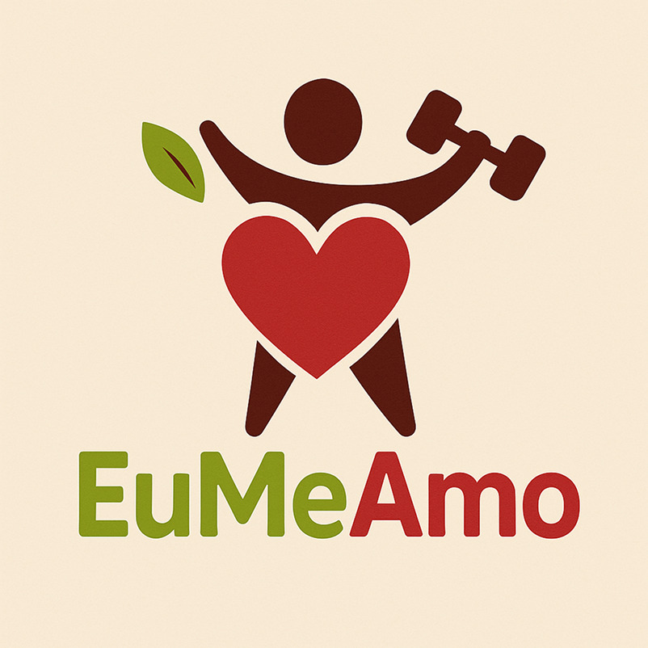

# __Projeto EuMeAmo__

### __Arquitetura e Desenho de Software__

#### __Entrega 3__

---

## Sobre 

**Projeto G3 - *Eu Me Amo*** é uma iniciativa voltada ao bem-estar físico e emocional, inspirada em plataformas e materiais informativos sobre autocuidado. O objetivo do projeto é promover hábitos saudáveis por meio de conteúdos que incentivam uma boa postura, a prática regular de exercícios físicos, o equilíbrio mental e o amor-próprio.

A solução desenvolvida pode ser apresentada em diferentes formatos — como site, aplicativo desktop ou app mobile — sempre buscando oferecer uma experiência acessível, intuitiva e acolhedora para quem deseja cuidar melhor de si.

---
## __Participantes__

| Foto | Nome | Matrícula |
|------|------|-----------|
|  | Arthur Fonseca Vale | 221031120 |
|  | Carlos Henrique de Souza Bispo | 211061529 |
|  | Fillipe Souto de Andrade | 190087188 |
|  | Gabriel Saraiva Canabrava | 202045769 |
|  | Letícia de Cássia Hladczuk Rodrigues | 221039209 |
|  | Lucas Gama De Araujo Bottino | 221008267 |
|  | Luiza Maluf Amorim | 221008294 |
|  | Mateus Levy Avelans Boquady | 190113901 |
|  | Pablo Serra Carvalho | 221008679 |
|  | Rodrigo Fonseca Rodrigues | 211062722 |
