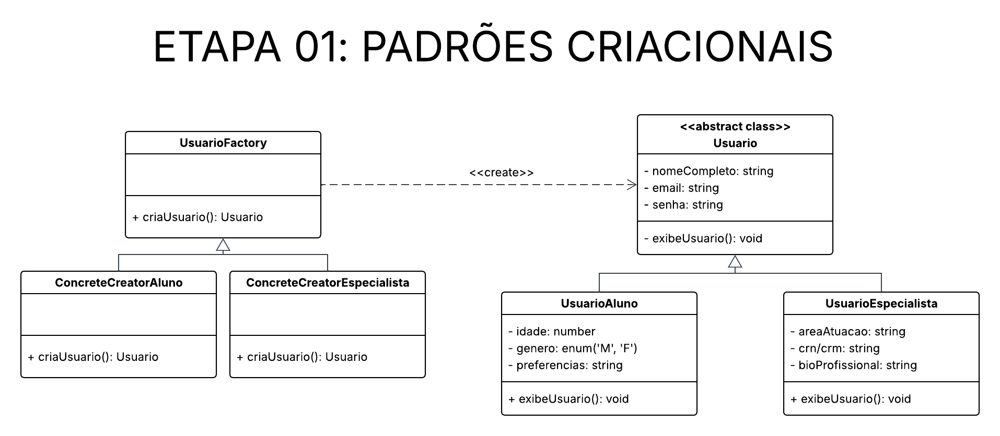

# __Padrão de Projeto: Factory Method__

## __Introdução__

Este artefato documenta a aplicação do padrão de projeto criacional Factory Method no projeto "Eu Me Amo". O objetivo deste padrão é fornecer uma interface para criar objetos em uma superclasse, permitindo que as subclasses alterem o tipo de objetos que serão criados. No contexto deste projeto, o padrão é utilizado para encapsular a criação de usuários com diferentes perfis: alunos e especialistas.

## __Metodologia__

O padrão Factory Method foi estudado com base nos materiasi recomendados pela professora Milene Serrano, por meio de slides e vídeos disponíveis na plataforma Aprender. Além da utilização do site [Refactoring.guru](https://refactoring.guru/pt-br/design-patterns/factory-method) para uma melhor visualização e visualização de exemplos de implementação.

Para a aplicação do padrão, seguimos os seguintes passos:

1. Identificamos os pontos do sistema onde diferentes tipos de objetos precisam ser criados (usuários do sistema);

2. Criamos uma classe abstrata **Usuario** e uma classe **UsuárioFactory**;

3. Implementamos subclasses concretas: **UsuarioAluno**,  **UsuarioEspecialista**, **ConcreteCreatorAluno** e **ConcreteCreatorEspecialista**;

4. Testamos a criação dos objetos a partir das fábricas concretas, validando o comportamento esperado.

## __Tabela de Participação na Produção do Artefato__

| 
Nome do Integrante | 
Artefato | 
Descrição da Contribuição | 
Análise Crítica* | 
Link Comprobatório |
|------------|----------|------------|------------|---------|
|  [Luiza Maluf]()| Factory Method | Eu modelei, desenvolvi e documentei a aplicação do padrão Factory Method. | A implementação do padrão Factory Method permite escalabilidade na criação de novos tipos de usuários sem modificar código existente, o que eu achei muito interessante como aprendizado. | [PR #1: Padrões de Projeto: Célula 04](https://github.com/UnBArqDsw2025-1-Turma01/2025.1-T01-_G3_EuMeAmo_Entrega_03/pull/1) |

## __Resultados__

- Atualização do diagrama de classe.

- Criação das classes Usuario, UsuarioAluno e UsuarioEspecialista.

- Implementação das fábricas ConcreteCreatorAluno e ConcreteCreatorEspecialista.

- Encapsulamento do processo de instanciação de objetos.

- Testes validados com diferentes tipos de usuário.

_**Autores:** [Lucas Bottino]() e [Luiza Maluf]()._

## __Gravação da Produção do Artefato__

A produção do artefato foi desenvolvida pessoalmente.

## __Rastreabilidade__

- [Diagrama de Classe da entrega 2](https://unbarqdsw2025-1-turma01.github.io/2025.1-T01-_G3_EuMeAmo_Entrega_02/#/Modelagem/2.1.1.DiagramaDeClasses)

## __Referências Bibliográficas__

> REFACTORING.GURU. Padrão de Projeto Factory Method. Refactoring.Guru, 2024. Disponível em: https://refactoring.guru/pt-br/design-patterns/factory-method. Acesso em: 27 maio 2025
## __Histórico de versões__

| Versão | Data | Descrição | Autor | Revisor |
|--------|------|-----------|-------|---------|
| '1.0'  | 27/05/2025 | Criação inicial do artefato de Factory Method | [Luiza Maluf]() | [Lucas Bottino]()| 