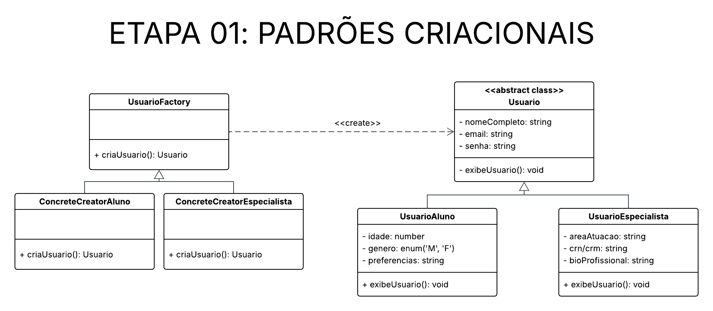
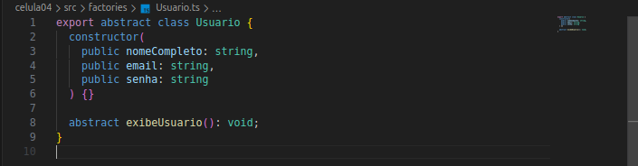
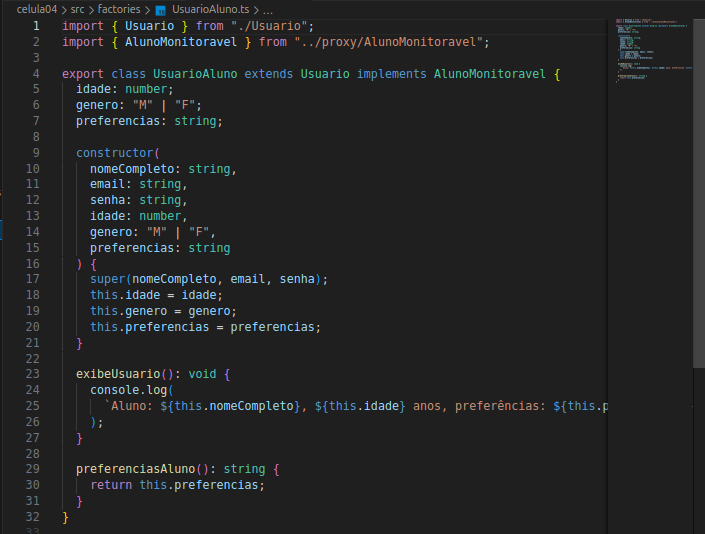
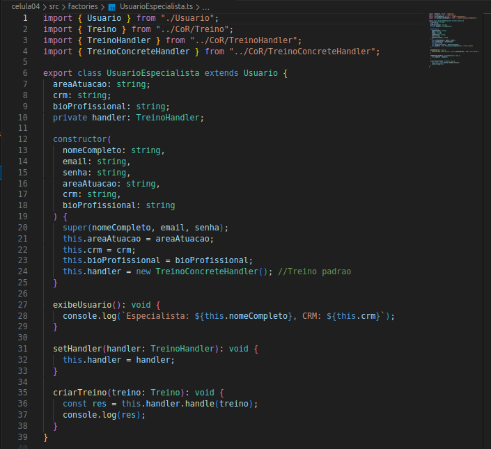
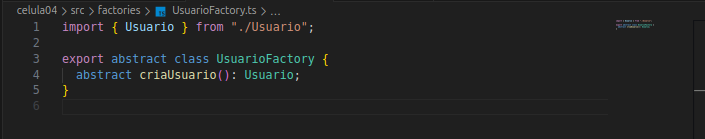
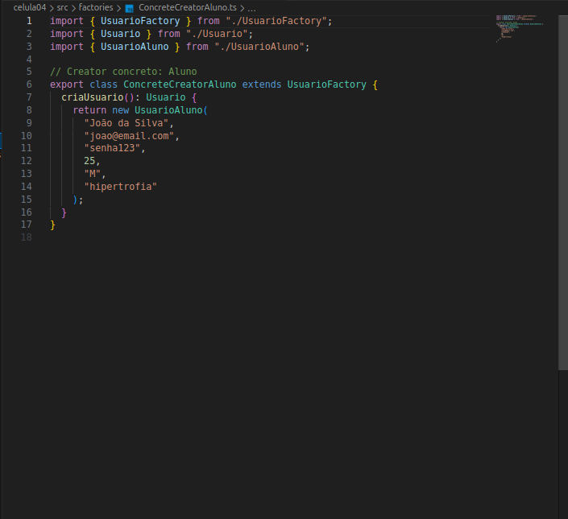
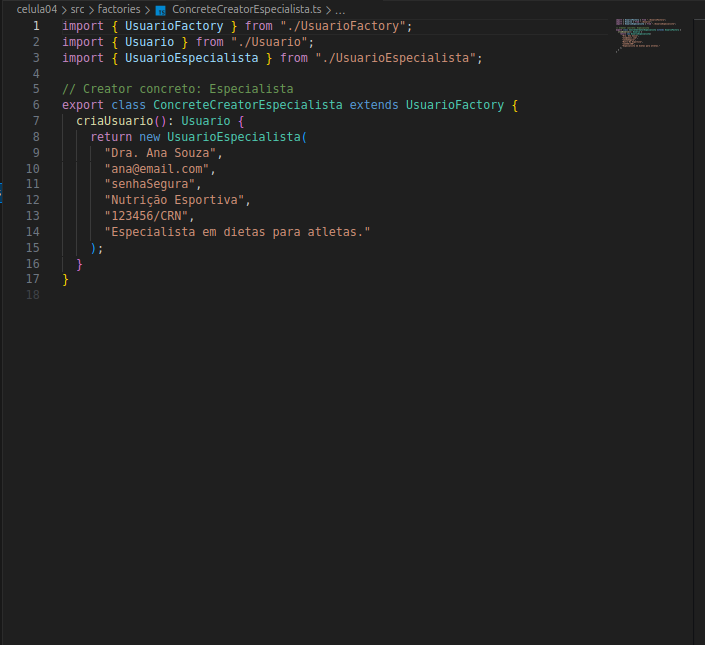
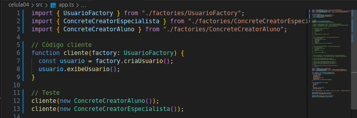
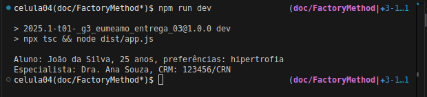

# __Padrão de Projeto: Factory Method__

## __Introdução__

Este artefato documenta a aplicação do padrão de projeto criacional Factory Method no projeto "Eu Me Amo". O objetivo deste padrão é fornecer uma interface para criar objetos em uma superclasse, permitindo que as subclasses alterem o tipo de objetos que serão criados. No contexto deste projeto, o padrão é utilizado para encapsular a criação de usuários com diferentes perfis: alunos e especialistas.

## __Metodologia__

O padrão Factory Method foi estudado com base nos materiais recomendados pela professora Milene Serrano, por meio de slides e vídeos disponíveis na plataforma Aprender. Além da utilização do site [Refactoring.guru](https://refactoring.guru/pt-br/design-patterns/factory-method) para uma melhor visualização e visualização de exemplos de implementação.

## __Tabela de Participação na Produção do Artefato__

| 
Nome do Integrante | 
Artefato | 
Descrição da Contribuição | 
Análise Crítica* | 
Link Comprobatório |
|------------|----------|------------|------------|---------|
|  [Luiza Maluf]()| Factory Method | Eu modelei, desenvolvi e documentei a aplicação do padrão Factory Method. | A implementação do padrão Factory Method permite escalabilidade na criação de novos tipos de usuários sem modificar código existente, o que eu achei muito interessante como aprendizado. | [PR #1: Padrões de Projeto: Célula 04](https://github.com/UnBArqDsw2025-1-Turma01/2025.1-T01-_G3_EuMeAmo_Entrega_03/pull/1) |
|  [Lucas Bottino]() | Factory Method | Modelei e desenvolvi o padrão Factory Method. | - | [PR #1: Padrões de Projeto: Célula 04](https://github.com/UnBArqDsw2025-1-Turma01/2025.1-T01-_G3_EuMeAmo_Entrega_03/pull/1) |

## __Aplicação no projeto__

No EuMeAmo, temos dois tipos de usuários: Aluno e Especialista. Cada um deles tem propriedades e comportamentos distintos, mas compartilham características básicas como nome, email e senha. O Factory Method foi aplicado para que a criaçào de instâncias desses usuários seja centralizada e encapsulada, mantendo o código desacoplado das implementações concretas.

### __Modelagem__

_**Autores:** [Lucas Bottino]() e [Luiza Maluf]()._

### __Implementação__

- Usuario (superclasse): define os atributos e métodos comuns entre os usuários.
- UsuarioAluno e UsuarioEspecialista: são subclasses que estendem Usuario e possuem atributos específicos.
- UsuarioFactory (interface): define o método factoryMethod que deve ser implementado pelas subclasses.
- ConcreteCreatorAluno e ConcreteCreatorEspecialista: são fábricas concretas que implementam o factoryMethod, retornando instâncias de UsuarioAluno ou UsuarioEspecialista.

_**src/factories/Usuario.ts**_

_**src/factories/UsuarioAluno.ts**_

_**src/factories/UsuarioEspecialista.ts**_

_**src/factories/UsuarioFactory.ts**_

_**src/factories/ConcreteCreatorAluno.ts**_

_**src/factories/ConcreteCreatorEspecialista.ts**_

### __Teste de Criação dos Usuários__

## __Rastreabilidade__

- [Diagrama de Classe da entrega 2](https://unbarqdsw2025-1-turma01.github.io/2025.1-T01-_G3_EuMeAmo_Entrega_02/#/Modelagem/2.1.1.DiagramaDeClasses)

## __Referências Bibliográficas__

> REFACTORING.GURU. Padrão de Projeto Factory Method. Refactoring.Guru, 2024. Disponível em: https://refactoring.guru/pt-br/design-patterns/factory-method. Acesso em: 27 maio 2025

## __Histórico de versões__

| Versão | Data | Descrição | Autor | Revisor |
|--------|------|-----------|-------|---------|
| '1.0'  | 27/05/2025 | Criação inicial do artefato de Factory Method | [Luiza Maluf]() | [Lucas Bottino]()| 