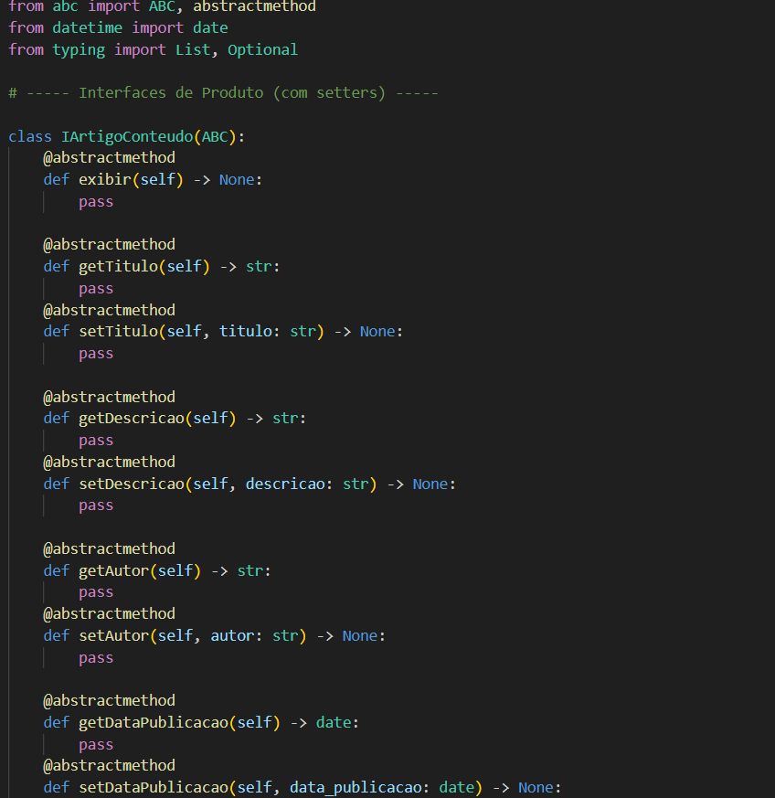
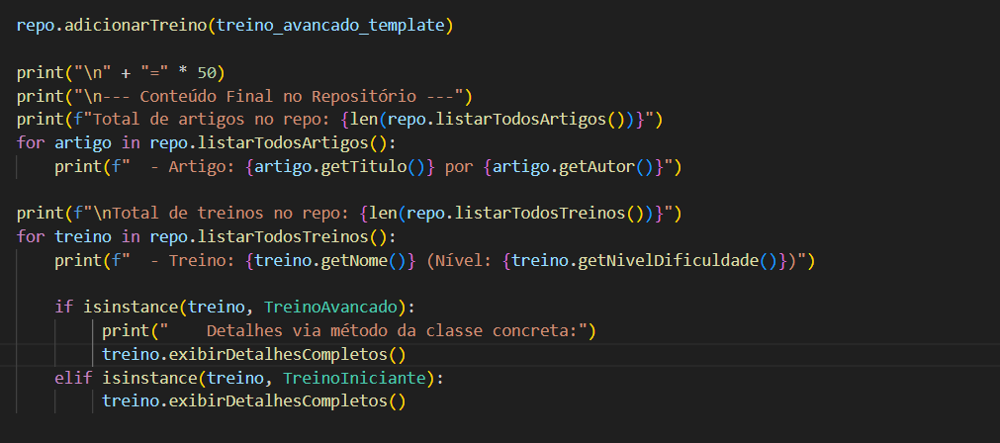

# Padrão de Projeto: Abstract Factory

## Introdução
Este artefato documenta a aplicação do padrão de projeto criacional Abstract Factory no projeto "Eu Me Amo". O objetivo deste padrão é fornecer uma interface para criar famílias de objetos relacionados ou dependentes sem especificar suas classes concretas. No contexto deste projeto, o padrão é utilizado para encapsular a criação de conjuntos de conteúdos (como Artigos e Treinos) que são tematicamente consistentes e adaptados a diferentes contextos ou perfis de usuário (por exemplo, Iniciante e Avançado).

## Metodologia
O padrão Abstract Factory foi estudado e implementado com base nos princípios de design de software orientado a objetos, que aprendemos nos materiais da professora Milene Serrano, por meio de slides e vídeos disponíveis na plataforma Aprender. Foram consultados materiais de referência sobre padrões de projeto, incluindo o site Refactoring.guru, para solidificar o entendimento e a aplicação.

## Tabela de Participação na Produção do Artefato

| Nome do Integrante | Artefato | Descrição da Contribuição            | Análise Crítica | Link Comprobatório |
|--------------------|----------|--------------------------------------|-----------------|--------------------|
| [Rodrigo Fonseca Rodrigues](https://github.com/rodfon3301) | Abstract Factory | ajudei  na modelagem e na construção do padrão | A introdução do Abstract Factory pode adicionar uma quantidade significativa de novas classes e interfaces ao sistema. Para cada família de produtos, você precisa de uma fábrica abstrata, múltiplas interfaces de produto abstrato, fábricas concretas e classes de produto concretas. Em sistemas pequenos ou com poucas famílias de produtos, essa estrutura pode parecer excessiva e mais complicada do que o necessário, tornando o código mais verboso e difícil de navegar inicialmente. A curva de aprendizado para entender todas as interconexões também pode ser um fator. | [Vídeo](https://youtu.be/KxxU4OKi-FA) ou [PR #3: Padrões de Projeto: Célula 01](https://github.com/UnBArqDsw2025-1-Turma01/2025.1-T01-_G3_EuMeAmo_Entrega_03/pull/3) |
| [Carlos Henrique](https://github.com/carlinn1) | Abstract Factory | ajudei  na modelagem e na construção do padrão | Na vez que a interface da fábrica abstrata (AbstractFactory) é definida com um conjunto específico de métodos de criação (ex: createProductA(), createProductB()), adicionar um novo tipo de produto à família global (ex: um ProductC) requer a alteração dessa interface de fábrica abstrata. Consequentemente, todas as classes de fábrica concretas que implementam essa interface também precisarão ser modificadas para incluir o método de criação do novo produto. Isso pode violar o Princípio Aberto/Fechado (Open/Closed Principle), pois as interfaces e classes existentes precisam ser alteradas, em vez de apenas estendidas. | [Vídeo](https://youtu.be/x5NieCra33c) ou [PR #3: Padrões de Projeto: Célula 01](https://github.com/UnBArqDsw2025-1-Turma01/2025.1-T01-_G3_EuMeAmo_Entrega_03/pull/3) |
| [Pablo Serra Carvalho](https://github.com/Pabloserrapxx) | Abstract Factory | ajudei  na modelagem, na construção do padrão e documentei o artefato | Embora o padrão desacople o cliente das classes de produto concretas, o cliente ainda precisa de alguma lógica para decidir qual fábrica concreta (ConcreteFactory) instanciar. Essa decisão pode, às vezes, introduzir condicionais (if/else ou switch) no código cliente ou requerer outro mecanismo (como um arquivo de configuração ou outro padrão criacional, como um Factory Method mais simples) para selecionar a fábrica apropriada. | [Vídeo](https://youtu.be/uVc7XvUdbO0) ou [PR #3: Padrões de Projeto: Célula 01](https://github.com/UnBArqDsw2025-1-Turma01/2025.1-T01-_G3_EuMeAmo_Entrega_03/pull/3) |

## Aplicação no projeto
No projeto "Eu Me Amo", é essencial que os usuários recebam um conjunto coeso de informações e atividades. Por exemplo, um usuário classificado como "Iniciante" deve receber artigos com linguagem e temas adequados para iniciantes, assim como planos de treino desenvolvidos para esse nível. Da mesma forma, um usuário "Avançado" necessita de uma família de conteúdos mais complexa e desafiadora.

O padrão Abstract Factory foi aplicado para gerenciar a criação dessas famílias de conteúdo. Temos diferentes fábricas (uma para conteúdo Iniciante, outra para conteúdo Avançado), e cada fábrica é capaz de criar um conjunto completo de produtos de conteúdo (um artigo, um treino, etc.) que são consistentes entre si e apropriados para o perfil alvo da fábrica. Isso garante que um `ArtigoIniciante` seja sempre acompanhado por um `TreinoIniciante` quando a `InicianteConteudoFactory` é utilizada.

## Modelagem
A modelagem do padrão Abstract Factory no projeto envolve os seguintes componentes principais:

* **`IConteudoFactory` (AbstractFactory):** Uma interface ou classe base abstrata que define métodos para criar os diferentes tipos de produtos de conteúdo abstratos (ex: `createArtigo()`, `createTreino()`).
* **`InicianteConteudoFactory`, `AvancadoConteudoFactory` (ConcreteFactories):** Classes concretas que implementam `IConteudoFactory`. Cada uma é responsável por instanciar uma família específica de produtos concretos (ex: `InicianteConteudoFactory` cria `ArtigoIniciante` e `TreinoIniciante`).
* **`IArtigoConteudo`, `ITreinoConteudo` (AbstractProducts):** Interfaces ou classes base abstratas que definem o contrato para cada tipo de produto de conteúdo que pode ser criado.
* **`ArtigoIniciante`, `ArtigoAvancado`, `TreinoIniciante`, `TreinoAvancado` (ConcreteProducts):** As implementações concretas dos produtos de conteúdo, específicas para cada família (nível).

## Implementação

Em Python, não usamos "interfaces" com uma palavra-chave dedicada (como interface em Java) principalmente por causa do "Duck Typing". A filosofia é: se um objeto se comporta como o esperado (tem os métodos e atributos necessários), ele pode ser usado, não importa seu tipo exato ou se ele "declara" implementar uma interface.

Além disso, Python é de tipagem dinâmica, então a verificação de tipos ocorre em tempo de execução. Para situações onde um contrato mais formal é útil, Python oferece as Classes Base Abstratas (ABCs), que cumprem um papel similar ao das interfaces

## Resultado

.png)

# Gravações
## Gravação da Produção do Artefato 

 <iframe width="560" height="315" src="https://www.youtube.com/embed/KxxU4OKi-FA" frameborder="0" allowfullscreen></iframe> 

## Gravação da Explicação do Artefato

 <iframe width="560" height="315" src="https://www.youtube.com/embed/x5NieCra33c" frameborder="0" allowfullscreen></iframe> 

## Gravação do Código Rodando

 <iframe width="560" height="315" src="https://www.youtube.com/embed/uVc7XvUdbO0" frameborder="0" allowfullscreen></iframe> 

## Referências Bibliográficas

1.  REFACTORING GURU. **Strategy Pattern**. Refactoring.Guru. Disponível em: [Clique aqui](https://refactoring.guru/pt-br/design-patterns/decorator). Acesso em: 28 maio 2025.

2.  SERRANO, Milene. **Material de Aula - Padrões de Projeto**. Disciplina de Arquitetura e Desenho de Software. Universidade de Brasília (UnB). Plataforma Aprender 3. Acesso em: 31 maio 2025.

| Versão | Data | Descrição | Autor | Revisor |
|--------|------|-----------|-------|---------|
| 1.0  | 31/05/2025 | Criação do documento inicial detalhando a implementação do padrão Decorator. | [Carlos Henrique](https://github.com/carlinn1), [Pablo Serra Carvalho](https://github.com/Pabloserrapxx), [Rodrigo Fonseca](https://github.com/rodfon3301) | - |
