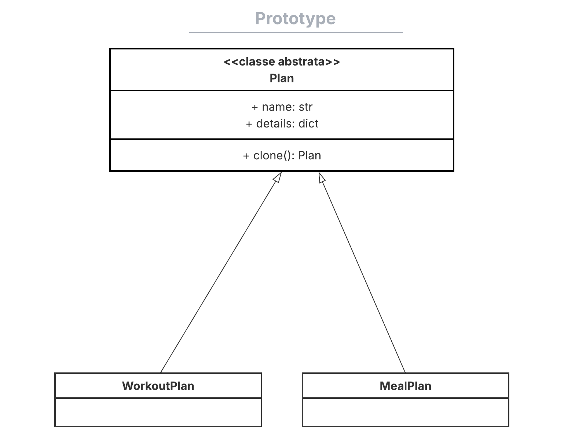
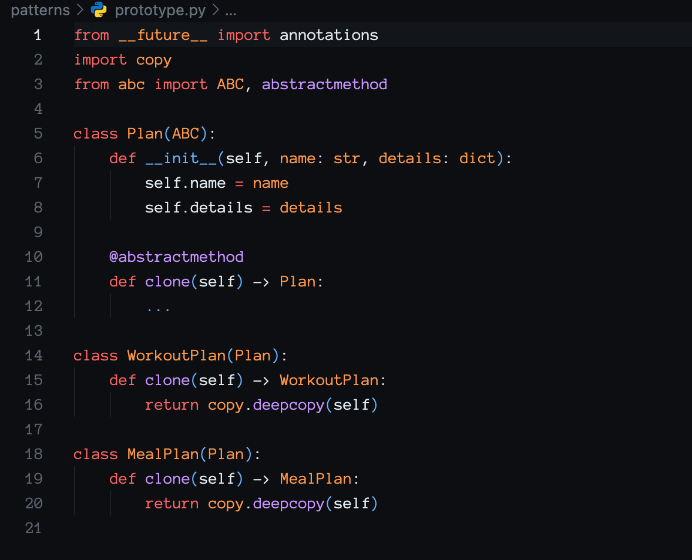

# __Padrão de Projeto: Prototype__

## __Introdução__

Este artefato documenta a aplicação do padrão de projeto criacional Prototype no projeto “Eu Me Amo”. O objetivo desse padrão é permitir a criação de novos objetos por meio da cópia (clone) de instâncias prototípicas, evitando a dependência direta de construtores e classes concretas. No contexto deste projeto, o Prototype é usado para replicar usuários com perfis distintos — alunos e especialistas — a partir de modelos pré-configurados, assegurando que cada instância possa ser customizada sem a necessidade de acoplamento rígido a hierarquias de classes.

## __Metodologia__

O padrão Prototype foi explorado a partir dos recursos indicados pela professora Milene Serrano — incluindo slides e vídeos na plataforma Aprender — e complementado pelo estudo dos exemplos práticos disponíveis no site [Refactoring.guru](https://refactoring.guru/pt-br/design-patterns/prototype).

## __Tabela de Participação na Produção do Artefato__

| 
Nome do Integrante | 
Artefato | 
Descrição da Contribuição | 
Análise Crítica | 
Link Comprobatório |
|------------|----------|------------|------------|---------|
|  [Mateus Levy](https://github.com/mateus9levy)| Prototype | Realizei o modelamento, a implementação e a documentação da aplicação do padrão Prototype. | A aplicação do padrão Prototype possibilita expandir a criação de novos perfis de usuário por meio da clonagem de instâncias prototípicas, sem alterar o código existente, o que se revelou um aprendizado muito enriquecedor. | [Video 1](https://unbbr-my.sharepoint.com/:v:/g/personal/202045769_aluno_unb_br/Edj9QH6HUIlCiZWWSQ2oRDEB1TaP1N7725oDhOg0SYzpxg?e=F6drSh&nav=eyJyZWZlcnJhbEluZm8iOnsicmVmZXJyYWxBcHAiOiJTdHJlYW1XZWJBcHAiLCJyZWZlcnJhbFZpZXciOiJTaGFyZURpYWxvZy1MaW5rIiwicmVmZXJyYWxBcHBQbGF0Zm9ybSI6IldlYiIsInJlZmVycmFsTW9kZSI6InZpZXcifX0%3D) e [Video 2](https://unbbr-my.sharepoint.com/:v:/g/personal/202045769_aluno_unb_br/EZAurW5nCXpHkFjEZaFLiakBicv4rRZbOsB_V4_MTOqfHw?e=TEMLRZ&nav=eyJyZWZlcnJhbEluZm8iOnsicmVmZXJyYWxBcHAiOiJTdHJlYW1XZWJBcHAiLCJyZWZlcnJhbFZpZXciOiJTaGFyZURpYWxvZy1MaW5rIiwicmVmZXJyYWxBcHBQbGF0Zm9ybSI6IldlYiIsInJlZmVycmFsTW9kZSI6InZpZXcifX0%3D) |
|  [Gabriel Saraiva](https://github.com/gabrielsarcan) | Prototype | Modelei e desenvolvi o padrão Prototype. | - | [Video 1](https://unbbr-my.sharepoint.com/:v:/g/personal/202045769_aluno_unb_br/Edj9QH6HUIlCiZWWSQ2oRDEB1TaP1N7725oDhOg0SYzpxg?e=F6drSh&nav=eyJyZWZlcnJhbEluZm8iOnsicmVmZXJyYWxBcHAiOiJTdHJlYW1XZWJBcHAiLCJyZWZlcnJhbFZpZXciOiJTaGFyZURpYWxvZy1MaW5rIiwicmVmZXJyYWxBcHBQbGF0Zm9ybSI6IldlYiIsInJlZmVycmFsTW9kZSI6InZpZXcifX0%3D) e [Video 2](https://unbbr-my.sharepoint.com/:v:/g/personal/202045769_aluno_unb_br/EZAurW5nCXpHkFjEZaFLiakBicv4rRZbOsB_V4_MTOqfHw?e=TEMLRZ&nav=eyJyZWZlcnJhbEluZm8iOnsicmVmZXJyYWxBcHAiOiJTdHJlYW1XZWJBcHAiLCJyZWZlcnJhbFZpZXciOiJTaGFyZURpYWxvZy1MaW5rIiwicmVmZXJyYWxBcHBQbGF0Zm9ybSI6IldlYiIsInJlZmVycmFsTW9kZSI6InZpZXcifX0%3D) |

## __Aplicação no projeto__

No projeto “Eu Me Amo”, o padrão Prototype foi implementado para a criação de planos, representados pela classe abstrata Plan e suas subclasses WorkoutPlan e MealPlan. Cada tipo de plano encapsula suas propriedades específicas, como nome e detalhes, e implementa o método clone() que realiza uma cópia profunda da instância. Dessa forma, novas instâncias não são criadas diretamente via construtor, mas sim por meio da clonagem de protótipos pré-configurados. Isso centraliza a lógica de criação, desacopla o código das implementações concretas e facilita a inclusão de novos tipos de planos, bastando definir novos protótipos sem modificar o fluxo de clonagem já existente.

### __Modelagem__

_**Autores:** [Mateus Levy](https://github.com/mateus9levy) e [Gabriel Saraiva](https://github.com/gabrielsarcan)._

### __Implementação__

### Implementação

- **Plan (superclasse abstrata):** define os atributos comuns, como `name` e `details`, e o método abstrato `clone()` para duplicação dos objetos.

- **WorkoutPlan** e **MealPlan:** subclasses concretas que estendem `Plan` e implementam o método `clone()` realizando uma cópia profunda (`deepcopy`) de si mesmas.

- **Uso do Prototype:** protótipos pré-configurados dessas classes são clonados para criar novas instâncias, mantendo a criação desacoplada dos construtores e facilitando a expansão do sistema com novos tipos de planos sem modificar o código existente.

_**project/patterns/prototype.py**_

## __Rastreabilidade__

- [Diagrama de Classe da entrega 2](https://unbarqdsw2025-1-turma01.github.io/2025.1-T01-_G3_EuMeAmo_Entrega_02/#/Modelagem/2.1.1.DiagramaDeClasses) 

## __Referências Bibliográficas__

> REFACTORING.GURU. Padrão de Projeto Prototype. Refactoring.Guru, 2024. Disponível em: https://refactoring.guru/pt-br/design-patterns/prototype. Acesso em: 28 maio 2025

## __Histórico de versões__

| Versão | Data | Descrição | Autor | Revisor |
|--------|------|-----------|-------|---------|
| '1.0'  | 29/05/2025 | Criação inicial do artefato de Prototype | [Mateus Levy](https://github.com/mateus9levy) | [Gabriel Saraiva](https://github.com/gabrielsarcan)| 