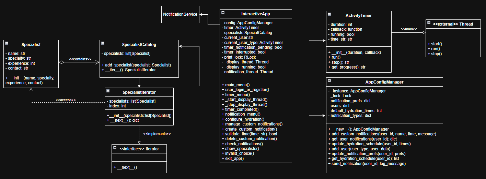
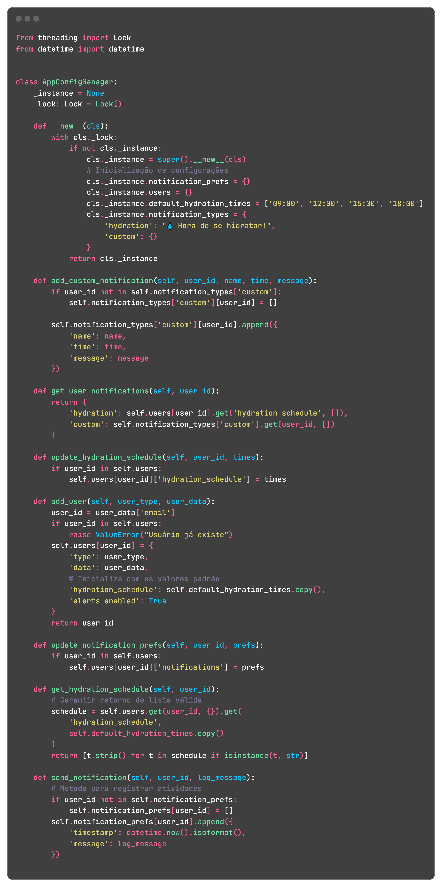

# __Padrão de Projeto: Singleton__

## __Introdução__

Este artefato tem como objetivo apresentar o padrão de projeto criacional Singleton no projeto "Eu Me Amo", que garante que uma classe tenha apenas uma instância e fornece um ponto global de acesso a ela. Esse padrão é amplamente utilizado quando é necessário controlar o acesso a recursos compartilhados, como conexões com banco de dados, arquivos de configuração ou logs de sistema.

## __Metodologia__

A elaboração deste artefato seguiu a metodologia de análise e implementação de padrões de projeto apresentada no conteúdo da disciplina, conforme as orientações da professora Milene Serrano. Além disso, foram utilizadas fontes complementares confiáveis, como os sites [Refactoring.guru](https://refactoring.guru/pt-br/design-patterns/singleton) e [TutorialsPoint](https://www.tutorialspoint.com/python_design_patterns/python_design_patterns_singleton.htm) que contribuíram para uma compreensão mais visual do padrão Singleton, bem como para a análise de exemplos práticos de implementação.

## __Tabela de Participação na Produção do Artefato__

| 
Nome do Integrante | 
Artefato | 
Descrição da Contribuição | 
Análise Crítica | 
Link Comprobatório |
|------------|----------|------------|------------|---------|
|  [Arthur Fonseca](https://github.com/arthurfonsecaa)| Singleton | |  | [PR #7: Padrões de Projeto: Célula 02](https://github.com/UnBArqDsw2025-1-Turma01/2025.1-T01-_G3_EuMeAmo_Entrega_03/pull/7)|
|  [Fillipe Souto](https://github.com/fillipeb50)| Singleton | | | [PR #7: Padrões de Projeto: Célula 02](https://github.com/UnBArqDsw2025-1-Turma01/2025.1-T01-_G3_EuMeAmo_Entrega_03/pull/7)|
|  [Letícia Hladczuk](https://github.com/HladczukLe)| Singleton | Eu modelei, desenvolvi e documentei a aplicação do padrão Singleton. | O padrão Adapter foi eficaz para integrar componentes incompatíveis sem alterar suas interfaces. Porém, seu uso excessivo pode ocultar falhas de projeto e aumentar a complexidade da manutenção.| [PR #7: Padrões de Projeto: Célula 02](https://github.com/UnBArqDsw2025-1-Turma01/2025.1-T01-_G3_EuMeAmo_Entrega_03/pull/7)|

## __Aplicação no projeto__

O padrão de projeto **Singleton** foi empregado na classe `AppConfigManager` com o objetivo de garantir a existência de uma única instância global responsável pela centralização e gerenciamento das configurações do sistema. Esta escolha visa evitar a duplicação de dados sensíveis, como preferências de notificação e horários de hidratação, promovendo consistência e controle em toda a aplicação.

A implementação adota mecanismos de **sincronização por meio da classe `Lock`** da biblioteca `threading`, assegurando que o acesso à instância única seja thread-safe. Isso é especialmente relevante em ambientes onde múltiplas threads podem interagir simultaneamente com as configurações globais.

As principais responsabilidades da classe Singleton incluem:

- Cadastro e gerenciamento de usuários;
- Armazenamento e recuperação de horários padrão de hidratação;
- Registro e personalização de mensagens de notificação;
- Registro de logs com data e hora para cada ação relevante do usuário.

O uso do Singleton neste contexto se mostrou adequado, pois a classe encapsula comportamentos relacionados a um recurso central da aplicação, garantindo integridade, reuso e previsibilidade no acesso às configurações.

### __Modelagem__

_**Autores:** [Arthur Fonseca](), [Leticia Hladczuk]() e [Fillipe Souto]()._

### __Implementação__

_**src/core/singleton/config_manager.py**_

### __Funcionamento do Projeto__

<iframe width="560" height="315" src="https://www.youtube.com/embed/zfsI5L--x5c?si=MzqqcT8fHyHleIi1&amp;start=148" title="YouTube video player" frameborder="0" allow="accelerometer; autoplay; clipboard-write; encrypted-media; gyroscope; picture-in-picture; web-share" referrerpolicy="strict-origin-when-cross-origin" allowfullscreen></iframe>

## __Gravação da Produção do Artefato__

<iframe width="560" height="315" src="https://www.youtube.com/embed/hBBzDHLvbuk?si=dSW_9b035BPHkdQc" title="YouTube video player" frameborder="0" allow="accelerometer; autoplay; clipboard-write; encrypted-media; gyroscope; picture-in-picture; web-share" referrerpolicy="strict-origin-when-cross-origin" allowfullscreen></iframe>

## __Rastreabilidade__

- [Diagrama de Classe da entrega 2](https://unbarqdsw2025-1-turma01.github.io/2025.1-T01-_G3_EuMeAmo_Entrega_02/#/Modelagem/2.1.1.DiagramaDeClasses)

## __Referências Bibliográficas__

- REFATORING.GURU. *Padrão Singleton*. Disponível em: [https://refactoring.guru/pt-br/design-patterns/singleton](https://refactoring.guru/pt-br/design-patterns/singleton). Acesso em: 29 maio 2025.

- TUTORIALSPOINT. *Python Design Patterns - Singleton*. Disponível em: [https://www.tutorialspoint.com/python_design_patterns/python_design_patterns_singleton.htm](https://www.tutorialspoint.com/python_design_patterns/python_design_patterns_singleton.htm). Acesso em: 29 maio. 2025.

## __Histórico de versões__

| Versão | Data | Descrição | Autor | Revisor |
|--------|------|-----------|-------|---------|
| '1.0'  | 01/06/2025 | Documentação do Singleton | [Letícia Hladczuk](https://github.com/HladczukLe) | [Revisor]()| 