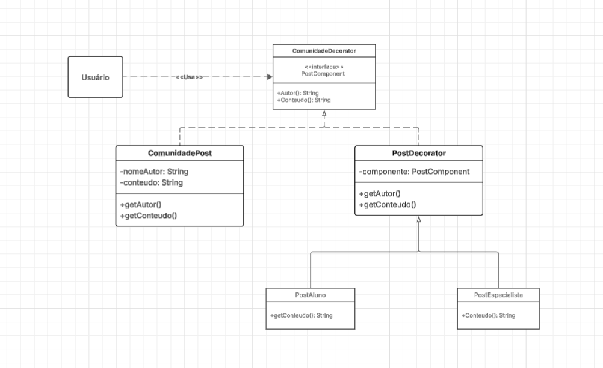

# Decorator (Padrão de Projeto Estrutural)

## Introdução

O padrão Decorator é um padrão de projeto estrutural que permite adicionar funcionalidades a objetos de forma flexível e dinâmica, sem alterar seu código-fonte. No projeto Eu Me Amo, o padrão foi utilizado para adicionar funcionalidades extras aos conteúdos e posts da comunidade, como marcar conteúdos como favoritos ou posts com comentários e curtidas.

## Metodologia

A aplicação do padrão estrutural Decorator no projeto Eu Me Amo seguiu uma abordagem baseada nos princípios da engenharia de software orientada a objetos. O objetivo foi refatorar os modelos existentes de forma a torná-los mais flexíveis, permitindo a adição de funcionalidades sem modificar suas implementações originais.

1 Análise dos Requisitos Funcionais
Foi realizada uma análise dos requisitos relacionados à área da comunidade e aos conteúdos do aplicativo. Identificaram-se as funcionalidades que deveriam ser adicionadas dinamicamente aos objetos:

  - Para ComunidadePost: curtidas, comentários, destaque.

  - Para Conteudo: marcar como favorito, tendência, recomendação.

2 Escolha do Padrão Decorator
- O padrão Decorator foi selecionado com base nos seguintes critérios:

- Desejo de adicionar funcionalidades de forma flexível;

Necessidade de evitar a criação de muitas subclasses com combinações diferentes de funcionalidades;

## Tabela de Participação na Produção do Artefato - Padrão Decorator

</center>

| Nome do Integrante | Artefato | Descrição da Contribuição | Análise Crítica | Link Comprobatório |
|--------------------|----------|---------------------------|-----------------|--------------------|
| [Rodrigo Fonseca Rodrigues](https://github.com/rodfon3301) | Decorator | Estruturação da interface `Conteudo`, implementação da classe base `ConteudoBase` e integração entre decorators | A base sólida da interface e da classe concreta foi essencial para que os decorators funcionassem corretamente, respeitando os princípios do SOLID. | [Vídeo](https://youtu.be/KxxU4OKi-FA) ou [PR #3: Padrões de Projeto: Célula 01](https://github.com/UnBArqDsw2025-1-Turma01/2025.1-T01-_G3_EuMeAmo_Entrega_03/pull/3) |
| [Carlos Henrique](https://github.com/carlinn1) | Decorator | Implementação do decorator `ConteudoModerado` com lógica de censura de palavras ofensivas | A moderação de conteúdo mostra como o Decorator pode ser útil em contextos reais, permitindo filtros sem alterar o conteúdo original. | [Vídeo](https://youtu.be/x5NieCra33c) ou [PR #3: Padrões de Projeto: Célula 01](https://github.com/UnBArqDsw2025-1-Turma01/2025.1-T01-_G3_EuMeAmo_Entrega_03/pull/3) |
| [Pablo Serra Carvalho](https://github.com/Pabloserrapxx) | Decorator | Implementação dos decorators `ConteudoComHashtags` e `ConteudoComMencoes` | Os filtros de hashtags e menções demonstram bem a flexibilidade do padrão, agregando funcionalidades ao conteúdo de forma modular. | [Vídeo](https://youtu.be/uVc7XvUdbO0) ou [PR #3: Padrões de Projeto: Célula 01](https://github.com/UnBArqDsw2025-1-Turma01/2025.1-T01-_G3_EuMeAmo_Entrega_03/pull/3) |


*__Observação sobre a Análise Crítica:__ Vale lembrar que análise crítica conta como participação no **Foco** e enriquece o projeto.*

*__Link Comprobatório:__ Serve gravação da produção do artefato e link para a ata da reunião em que você esteve presente*

**IMPORTANTE!!!!**

**O integrante que **não** registar sua participação não terá sua participação passada para a professora, recebendo **ZERO** no foco em questão. Vale lembrar que para a **nota MM é necessário uma participação mínima nos TRÊS FOCOS.**

</center>


### Diagrama de Implementação



**1. Decorator:**

### Interface Abstrata (Component)
```dart
abstract class Conteudo {
  String getDescricao();
  String getAutor();
}
```

### Estratégias Concretas (ConcreteComponent e ConcreteDecorators)

#### ConcreteComponent
```dart
class ConteudoBase implements Conteudo {
  final String descricao;
  final String autor;

  ConteudoBase({required this.descricao, required this.autor});

  @override
  String getDescricao() => descricao;

  @override
  String getAutor() => autor;
}
```

#### Decorator Abstrato
```dart
abstract class ConteudoDecorator implements Conteudo {
  final Conteudo conteudo;

  ConteudoDecorator(this.conteudo);

  @override
  String getDescricao() => conteudo.getDescricao();

  @override
  String getAutor() => conteudo.getAutor();
}
```

#### ConcreteDecorators
```dart
class ConteudoComHashtags extends ConteudoDecorator {
  ConteudoComHashtags(super.conteudo);

  @override
  String getDescricao() => '${super.getDescricao()} #fitness #bemestar';
}

class ConteudoComMencoes extends ConteudoDecorator {
  ConteudoComMencoes(super.conteudo);

  @override
  String getDescricao() => '${super.getDescricao()} @usuario123';
}

class ConteudoModerado extends ConteudoDecorator {
  ConteudoModerado(super.conteudo);

  @override
  String getDescricao() {
    final descricao = super.getDescricao();
    return descricao.replaceAll(RegExp(r'(?i)palavrao'), '****');
  }
}
```
# Gravações
## Gravação da Produção do Artefato 
<div align="center"> <iframe width="560" height="315" src="https://www.youtube.com/embed/KxxU4OKi-FA" frameborder="0" allowfullscreen></iframe> </div>

## Gravação da Explicação do Artefato
<div align="center"> <iframe width="560" height="315" src="https://www.youtube.com/embed/x5NieCra33c" frameborder="0" allowfullscreen></iframe> </div>

## Gravação do Código Rodando
<div align="center"> <iframe width="560" height="315" src="colocar o video de voces" frameborder="0" allowfullscreen></iframe> </div>

## Rastreabilidade

-   [Diagrama de Classes](https://unbarqdsw2025-1-turma01.github.io/2025.1-T01-_G3_EuMeAmo_Entrega_02/#/Modelagem/2.1.1.DiagramaDeClasses): A implementação interage com as classes `Treino` e `Conteudo` definidas no diagrama.
-   [Requisitos Funcionais](https://unbarqdsw2025-1-turma01.github.io/2025.1-T01-_G3_EuMeAmo_Entrega_01/#/Base/1.5.6.Tabela-Requisitos): Atende aos requisitos relacionados à criação e diversificação de rotinas de treino (ex: RF005 - Gerenciar Treinos, RF006 - Visualizar Ficha de Treino, se aplicável).


## Referências Bibliográficas

1.  GAMMA, E. et al. **Padrões de Projeto: Soluções Reutilizáveis de Software Orientado a Objetos**. Porto Alegre: Bookman, 2000.

2.  REFACTORING GURU. **Strategy Pattern**. Refactoring.Guru. Disponível em: [Clique aqui](https://refactoring.guru/pt-br/design-patterns/decorator). Acesso em: 28 maio 2025.

3.  SERRANO, Milene. **Material de Aula - Padrões de Projeto**. Disciplina de Arquitetura e Desenho de Software. Universidade de Brasília (UnB). Plataforma Aprender 3. Acesso em: 31 maio 2025.


| Versão | Data | Descrição | Autor | Revisor |
|--------|------|-----------|-------|---------|
| 1.0  | 31/05/2025 | Criação do documento inicial detalhando a implementação do padrão Decorator. | [Carlos Henrique](https://github.com/carlinn1), [Pablo Serra Carvalho](https://github.com/Pabloserrapxx), [Rodrigo Fonseca](https://github.com/rodfon3301) |  [Pablo Serra Carvalho](https://github.com/Pabloserrapxx) |
