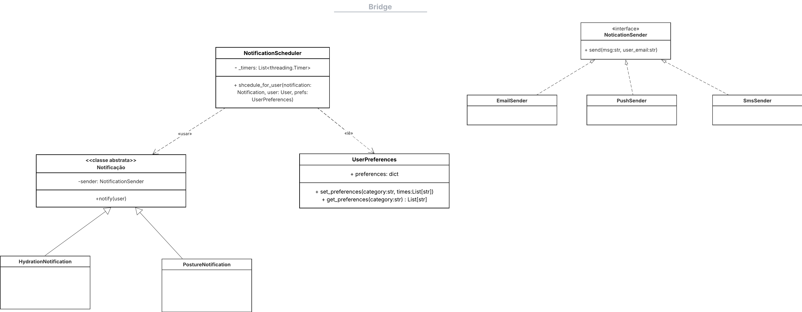
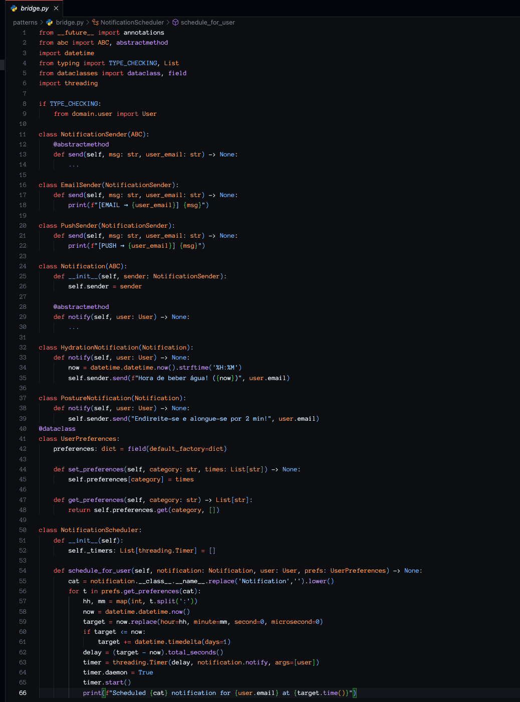

# __Padrão de Projeto: Bridge__

## __Introdução__

Este artefato documenta a aplicação do padrão de projeto estrutural **Bridge** no projeto "Eu Me Amo". O padrão Bridge tem como objetivo desacoplar uma abstração da sua implementação, permitindo que ambas possam variar independentemente. No contexto do projeto, o Bridge é utilizado para separar a lógica das notificações da forma como elas são enviadas, facilitando a extensão e manutenção do sistema sem impactar as classes clientes.

## __Metodologia__

O padrão Proxy foi estudado com base nos materiais recomendados pela professora Milene Serrano, por meio de slides e vídeos disponíveis na plataforma Aprender. Além da utilização do site [Refactoring.guru](https://refactoring.guru/pt-br/design-patterns/bridge) para uma melhor visualização e visualização de exemplos de implementação.

## __Tabela de Participação na Produção do Artefato__

| 
Nome do Integrante | 
Artefato | 
Descrição da Contribuição | 
Análise Crítica* | 
Link Comprobatório |
|------------|----------|------------|------------|---------|
|  [Mateus Levy](https://github.com/mateus9levy)| Bridge | Modelei, desenvolvi e documentei a aplicação do padrão Bridge. | - | [Video 1](https://unbbr-my.sharepoint.com/:v:/g/personal/202045769_aluno_unb_br/Edj9QH6HUIlCiZWWSQ2oRDEB1TaP1N7725oDhOg0SYzpxg?e=F6drSh&nav=eyJyZWZlcnJhbEluZm8iOnsicmVmZXJyYWxBcHAiOiJTdHJlYW1XZWJBcHAiLCJyZWZlcnJhbFZpZXciOiJTaGFyZURpYWxvZy1MaW5rIiwicmVmZXJyYWxBcHBQbGF0Zm9ybSI6IldlYiIsInJlZmVycmFsTW9kZSI6InZpZXcifX0%3D) e [Video 2](https://unbbr-my.sharepoint.com/:v:/g/personal/202045769_aluno_unb_br/EZAurW5nCXpHkFjEZaFLiakBicv4rRZbOsB_V4_MTOqfHw?e=TEMLRZ&nav=eyJyZWZlcnJhbEluZm8iOnsicmVmZXJyYWxBcHAiOiJTdHJlYW1XZWJBcHAiLCJyZWZlcnJhbFZpZXciOiJTaGFyZURpYWxvZy1MaW5rIiwicmVmZXJyYWxBcHBQbGF0Zm9ybSI6IldlYiIsInJlZmVycmFsTW9kZSI6InZpZXcifX0%3D)|
|   [Gabriel Saraiva](https://github.com/gabrielsarcan) | Bridge | Modelei e desenvolvi o padrão Bridge | - | [Video 1](https://unbbr-my.sharepoint.com/:v:/g/personal/202045769_aluno_unb_br/Edj9QH6HUIlCiZWWSQ2oRDEB1TaP1N7725oDhOg0SYzpxg?e=F6drSh&nav=eyJyZWZlcnJhbEluZm8iOnsicmVmZXJyYWxBcHAiOiJTdHJlYW1XZWJBcHAiLCJyZWZlcnJhbFZpZXciOiJTaGFyZURpYWxvZy1MaW5rIiwicmVmZXJyYWxBcHBQbGF0Zm9ybSI6IldlYiIsInJlZmVycmFsTW9kZSI6InZpZXcifX0%3D) e [Video 2](https://unbbr-my.sharepoint.com/:v:/g/personal/202045769_aluno_unb_br/EZAurW5nCXpHkFjEZaFLiakBicv4rRZbOsB_V4_MTOqfHw?e=TEMLRZ&nav=eyJyZWZlcnJhbEluZm8iOnsicmVmZXJyYWxBcHAiOiJTdHJlYW1XZWJBcHAiLCJyZWZlcnJhbFZpZXciOiJTaGFyZURpYWxvZy1MaW5rIiwicmVmZXJyYWxBcHBQbGF0Zm9ybSI6IldlYiIsInJlZmVycmFsTW9kZSI6InZpZXcifX0%3D) |

## __Aplicação no projeto__

No “Eu Me Amo”, o padrão Bridge foi aplicado para separar a abstração das notificações da sua implementação de envio. Temos diferentes tipos de notificações, como HydrationNotification e PostureNotification, que representam a lógica de notificação, enquanto a forma como elas são enviadas — via email, push ou SMS — é tratada por implementações concretas de NotificationSender (EmailSender, PushSender, SmsSender).

### __Modelagem__

_**Autores:** [Mateus Levy](https://github.com/mateus9levy) e  [Gabriel Saraiva](https://github.com/gabrielsarcan)._

### **Implementação**

* **NotificationSender (interface):** define a interface para os métodos de envio de notificações.
* **EmailSender, PushSender e SmsSender:** implementações concretas de `NotificationSender` que realizam o envio via email, push ou SMS.
* **Notification (classe abstrata):** contém uma referência a um objeto `NotificationSender` e define o método `notify()` que delega o envio ao sender.
* **HydrationNotification e PostureNotification:** subclasses concretas de `Notification` que implementam tipos específicos de notificações, utilizando diferentes canais de envio por meio da composição com `NotificationSender`.

_**project/patterns/prototype.py**_

## __Rastreabilidade__

- [Diagrama de Classe da entrega 2](https://unbarqdsw2025-1-turma01.github.io/2025.1-T01-_G3_EuMeAmo_Entrega_02/#/Modelagem/2.1.1.DiagramaDeClasses)

## __Referências Bibliográficas__

> REFACTORING.GURU. Padrão de Projeto Bridge. Refactoring.Guru, 2024. Disponível em: https://refactoring.guru/design-patterns/bridge. Acesso em: 28 maio 2025

## __Histórico de versões__

| Versão | Data | Descrição | Autor | Revisor |
|--------|------|-----------|-------|---------|
| '1.0'  | 29/05/2025 | Criação inicial do artefato de Bridge|  [Mateus Levy](https://github.com/mateus9levy)| [Gabriel Saraiva](https://github.com/gabrielsarcan)| 