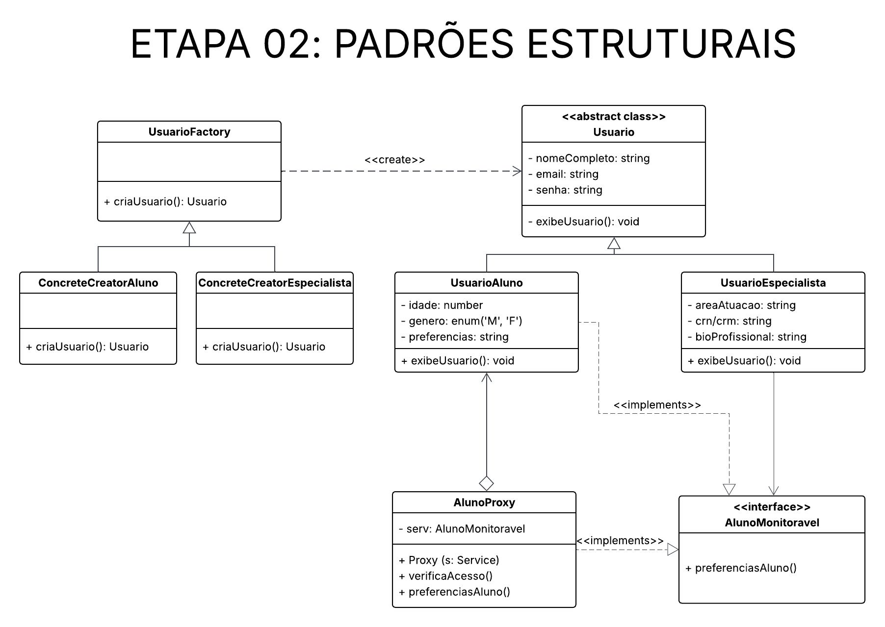
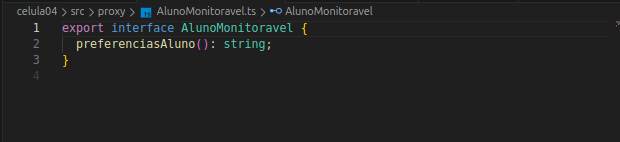
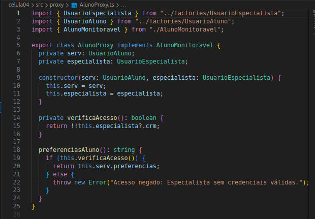
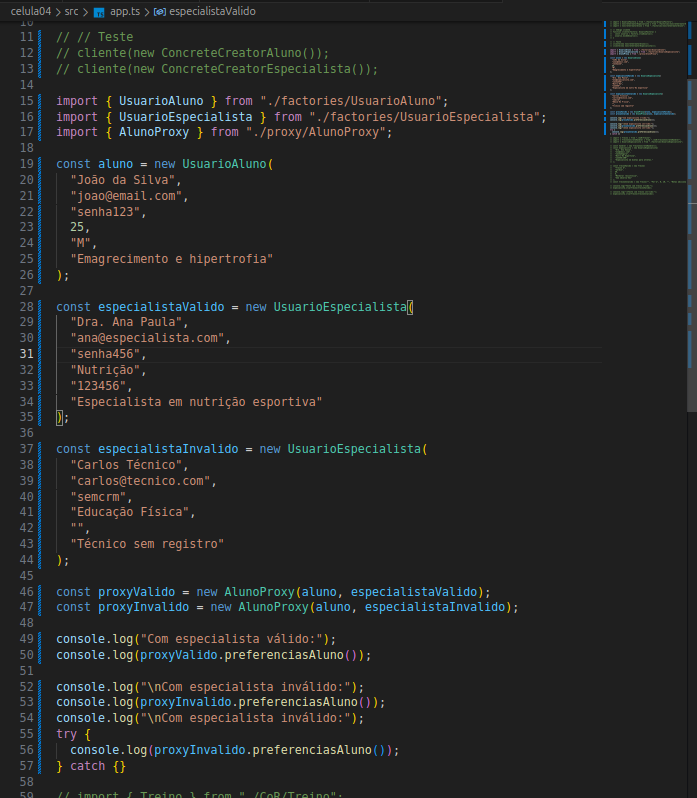
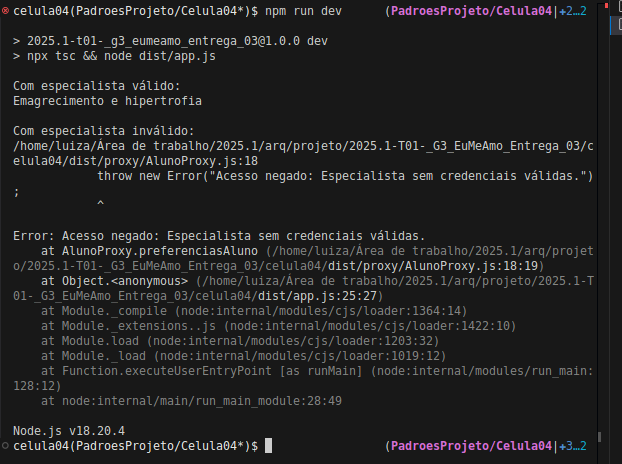

# __Padrão de Projeto: Proxy__

## __Introdução__

Este artefato documenta a aplicação do padrão de projeto estrutural Proxy no projeto "Eu Me Amo". O padrão Proxy fornece um substituto ou representante de outro objeto para controlar o acesso a ele. Pode ser utilizado para implementar controle de acesso, lazy loading, logging, cache, entre outros comportamentos adicionais, sem modificar a lógica do objeto real.

## __Metodologia__

O padrão Proxy foi estudado com base nos materiais recomendados pela professora Milene Serrano, por meio de slides e vídeos disponíveis na plataforma Aprender. Além da utilização do site [Refactoring.guru](https://refactoring.guru/pt-br/design-patterns/factory-method) para uma melhor visualização e visualização de exemplos de implementação.

## __Tabela de Participação na Produção do Artefato__

| 
Nome do Integrante | 
Artefato | 
Descrição da Contribuição | 
Análise Crítica* | 
Link Comprobatório |
|------------|----------|------------|------------|---------|
|  [Luiza Maluf]()| Proxy | Eu modelei, desenvolvi e documentei a aplicação do padrão Proxy. | - | [PR #1: Padrões de Projeto: Célula 04](https://github.com/UnBArqDsw2025-1-Turma01/2025.1-T01-_G3_EuMeAmo_Entrega_03/pull/1) |
|  [Lucas Bottino]() | Proxy | Modelei e desenvolvi o padrão Proxy | - | [PR #1: Padrões de Projeto: Célula 04](https://github.com/UnBArqDsw2025-1-Turma01/2025.1-T01-_G3_EuMeAmo_Entrega_03/pull/1) |

## __Aplicação no projeto__

No EuMeAmo, temos dois tipos de usuários: Aluno e Especialista. Cada um deles tem propriedades e comportamentos distintos, mas compartilham características básicas como nome, email e senha. O Factory Method foi aplicado para que a criaçào de instâncias desses usuários seja centralizada e encapsulada, mantendo o código desacoplado das implementações concretas.

### __Modelagem__

_**Autores:** [Lucas Bottino]() e [Luiza Maluf]()._

### __Implementação__

- AlunoMonitoravel.ts: representa o objetivo real, com os dados e comportamentos do aluno.
- AlunoProxy.ts: representa o proxy, que contém uma refência a um AlunoMonitoravel e adiciona lógica antes/depois de delegar o método.
- app.ts: código cliente que instância e utiliza a proxy.

_**src/Proxy/AlunoMonitoravel.ts**_

_**rc/Proxy/AlunoProxy.ts**_

### __Teste de Funcionamento__

## __Rastreabilidade__

- [Diagrama de Classe da entrega 2](https://unbarqdsw2025-1-turma01.github.io/2025.1-T01-_G3_EuMeAmo_Entrega_02/#/Modelagem/2.1.1.DiagramaDeClasses)

## __Referências Bibliográficas__

> REFACTORING.GURU. Padrão de Projeto Factory Method. Refactoring.Guru, 2024. Disponível em: https://refactoring.guru/pt-br/design-patterns/factory-method. Acesso em: 27 maio 2025

## __Histórico de versões__

| Versão | Data | Descrição | Autor | Revisor |
|--------|------|-----------|-------|---------|
| '1.0'  | 29/05/2025 | Criação inicial do artefato de Proxy| [Luiza Maluf]() | [Lucas Bottino]()| 