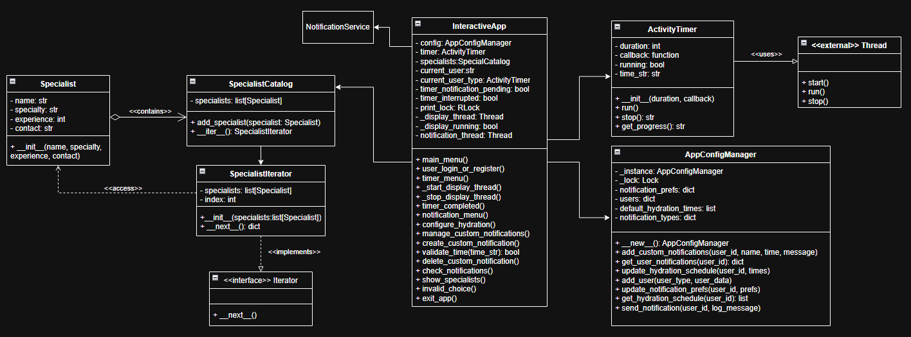

# __Padrão de Projeto: Adapter__

## __Introdução__

Este artefato documenta a implementação do padrão de projeto Adapter no contexto do projeto de software proposto para a disciplina. O objetivo é integrar um sistema de temporizador de atividades com uma interface padronizada e reaproveitável, adaptando o comportamento de uma classe `Thread` para um formato mais compatível com as necessidades da aplicação.

O padrão Adapter é essencial quando se deseja reutilizar classes existentes que não implementam exatamente a interface esperada, promovendo flexibilidade e reaproveitamento de código com baixo acoplamento.

## __Metodologia__

O padrão Adapter, segundo Gamma et al. (1995), é um dos 23 padrões de projeto GoF (Gang of Four), que tem como principal finalidade permitir que classes com interfaces incompatíveis trabalhem juntas por meio de uma interface de adaptação. Este padrão é classificado como estrutural, pois lida com a composição das classes e objetos para formar estruturas maiores.

A aplicação do padrão foi feita por meio da criação de uma classe `ActivityTimer`, que herda de `Thread`, adaptando a execução de temporizadores em segundo plano (background) para se integrar ao restante do sistema por meio de métodos como `start`, `stop`, `get_progress` e o uso de callbacks como mecanismo de integração com o `AppConfigManager`, em `main.py`.

A escolha deste padrão no projeto se deu pela necessidade de aproveitar as funcionalidades da classe `Thread` do Python (biblioteca padrão) sem exigir que o restante do sistema dependesse diretamente de sua interface.

A produção seguiu os seguintes passos:

- Estudo do material da disciplina (Prof.ª Milene Serrano via Aprender);

- Revisão teórica do padrão Adapter na literatura (GoF), usando o site do [Refactoring.guru](https://refactoring.guru/pt-br/design-patterns/adapter);

- Modelagem da classe adaptadora `ActivityTimer`;

- Implementação da adaptação e testes de integração com a lógica de notificação.

## __Tabela de Participação na Produção do Artefato__

| 
Nome do Integrante | 
Artefato | 
Descrição da Contribuição | 
Análise Crítica | 
Link Comprobatório |
|------------|----------|------------|------------|---------|
|  [Arthur Fonseca](https://github.com/arthurfonsecaa)| Adapter | Eu modelei, desenvolvi e documentei a aplicação do padrão Adaptor.| O artefato produzido é fundamental para garantir a integração desacoplada entre sistemas. A utilização do padrão Adapter se mostrou eficaz ao permitir a reutilização da API da Thread sem comprometer a arquitetura geral. | [PR #7: Padrões de Projeto: Célula 02](https://github.com/UnBArqDsw2025-1-Turma01/2025.1-T01-_G3_EuMeAmo_Entrega_03/pull/7) |
|  [Letícia Hladczuk](https://github.com/HladczukLe)| Adapter | Eu contribui na modelagem e desenvolvimento do padrão Adaptor.| O padrão Adapter foi eficaz para integrar componentes incompatíveis sem alterar suas interfaces. Porém, seu uso excessivo pode ocultar falhas de projeto e aumentar a complexidade da manutenção.| [PR #7: Padrões de Projeto: Célula 02](https://github.com/UnBArqDsw2025-1-Turma01/2025.1-T01-_G3_EuMeAmo_Entrega_03/pull/7) |

## __Aplicação no projeto__

Essa classe permitiu adaptar o comportamento da `Thread` para se comportar como um temporizador orientado a eventos, com funções auxiliares como `stop()` e `get_progress()`, além de suportar o uso de callback ao término do tempo definido. Dessa forma, foi possível integrar o temporizador com o singleton `AppConfigManager`, acionando notificações programadas de forma desacoplada.

O artefato está modelado no diagrama geral do sistema, sendo representado como uma adaptação direta da estrutura `Thread`, encapsulando sua complexidade e oferecendo uma interface personalizada para o domínio da aplicação.

Além disso, o artefato foi validado em conjunto com os demais padrões (Singleton e Iterator), demonstrando compatibilidade e eficiência na integração entre os módulos.

### __Modelagem__

_**Autores:** [Arthur Fonseca](), [Leticia Hladczuk]() e [Fillipe Souto]()._

### __Implementação__

_**src/core/adapter/timer_adapter.py**_

### __Funcionamento do Timer__

<iframe width="560" height="315" src="https://www.youtube.com/embed/zfsI5L--x5c?si=MzqqcT8fHyHleIi1&amp;start=148" title="YouTube video player" frameborder="0" allow="accelerometer; autoplay; clipboard-write; encrypted-media; gyroscope; picture-in-picture; web-share" referrerpolicy="strict-origin-when-cross-origin" allowfullscreen></iframe>

## __Gravação da Produção do Artefato__

<iframe width="560" height="315" src="https://www.youtube.com/embed/hBBzDHLvbuk?si=dSW_9b035BPHkdQc" title="YouTube video player" frameborder="0" allow="accelerometer; autoplay; clipboard-write; encrypted-media; gyroscope; picture-in-picture; web-share" referrerpolicy="strict-origin-when-cross-origin" allowfullscreen></iframe>

## __Rastreabilidade__

## __Referências Bibliográficas__

> GAMMA, Erich; HELM, Richard; JOHNSON, Ralph; VLISSIDES, John. Padrões de Projeto: Soluções reutilizáveis de software orientado a objetos. Porto Alegre: Bookman, 2000.

> PYTHON SOFTWARE FOUNDATION. The threading module — Python 3 Documentation. Disponível em: https://docs.python.org/3/library/threading.html. Acesso em: 01 jun. 2025.

> Refactoring.Guru. Padrão de projeto Adapter. Disponível em: https://refactoring.guru/pt-br/design-patterns/adapter. Acesso em: 01 jun. 2025.

## __Histórico de versões__

| Versão | Data | Descrição | Autor | Revisor |
|--------|------|-----------|-------|---------|
| `1.0`  | 30/05/2025 | Documentação do Adapter | [Arthur Fonseca](https://github.com/arthurfonsecaa) | [Revisor]()| 