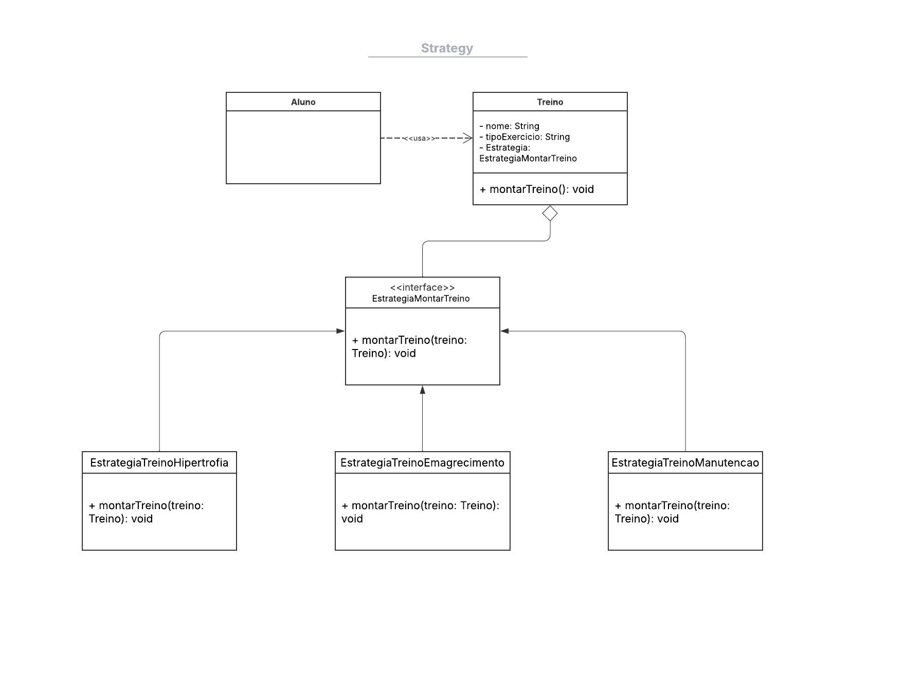

# Strategy (Padrão de Projeto Comportamental)

## Introdução

Este documento detalha a implementação do padrão de projeto *Strategy* no contexto do aplicativo "EuMeAmo". O objetivo principal da adoção deste padrão foi proporcionar flexibilidade na definição e seleção de diferentes algoritmos (estratégias) para a montagem de treinos personalizados para os usuários, como treinos focados em hipertrofia, emagrecimento ou manutenção. A implementação visa desacoplar a lógica de montagem de treino da classe principal `Treino`, permitindo que novas estratégias sejam adicionadas ou modificadas sem impactar o código existente, seguindo os princípios de design SOLID, especialmente o Princípio Aberto/Fechado.

## Metodologia

O padrão *Strategy* é um padrão de projeto comportamental que permite definir uma família de algoritmos, encapsular cada um deles e torná-los intercambiáveis. O *Strategy* permite que o algoritmo varie independentemente dos clientes que o utilizam (GAMMA et al., 2000). Essencialmente, ele transforma um conjunto de comportamentos em objetos (estratégias) e utiliza delegação para decidir qual comportamento usar em tempo de execução.

No projeto "EuMeAmo", a metodologia adotada para implementar o padrão *Strategy* envolveu os seguintes passos:

1.  **Definição da Interface da Estratégia:** Foi criada uma classe abstrata `EstrategiaMontarTreino` que define o método comum `montarTreino`, o qual deve ser implementado por todas as estratégias concretas. Esta interface estabelece o contrato que todas as estratégias de montagem de treino devem seguir.
2.  **Implementação das Estratégias Concretas:** Foram desenvolvidas classes concretas que implementam a interface `EstrategiaMontarTreino` para diferentes objetivos de treino: `EstrategiaTreinoHipertrofia`, `EstrategiaTreinoEmagrecimento` e `EstrategiaTreinoManutencao`. Cada classe encapsula a lógica específica para gerar uma lista de exercícios (`Conteudo`) adequada ao seu objetivo.
3.  **Adaptação da Classe Contexto:** A classe `Treino` (ou uma classe auxiliar/fábrica, devido à imutabilidade do modelo `Treino` original) atua como o contexto. Em vez de conter a lógica de montagem diretamente, ela recebe ou utiliza um objeto de estratégia. A implementação foi adaptada para retornar uma nova instância de `Treino` configurada pela estratégia selecionada, respeitando a estrutura imutável do modelo existente no projeto.
4.  **Utilização pelo Cliente:** O cliente (por exemplo, uma tela ou controller responsável pela criação de treinos) seleciona a estratégia desejada e a utiliza para obter um objeto `Treino` configurado.

Esta abordagem permite que o sistema selecione dinamicamente o algoritmo de montagem de treino apropriado com base nas necessidades ou preferências do usuário, promovendo maior flexibilidade e manutenibilidade do código (REFACTORING GURU, 2025).

## Tabela de Participação na Produção do Artefato

<center>

| <center>Nome do<br>Integrante | <center>Artefato | <center>Descrição da<br>Contribuição | <center>Análise Crítica* | <center>Link Comprobatório |
|------------|----------|------------|------------|---------|
|  [Carlos Henrique](https://github.com/carlinn1)| Documentação do Padrão Strategy | Participei da definição da interface `EstrategiaMontarTreino` e da implementação da estratégia concreta `EstrategiaTreinoHipertrofia`. Colaborei na adaptação do padrão para o modelo `Treino` imutável existente e na documentação inicial da metodologia. | Acredito que a adoção do padrão Strategy foi crucial para a flexibilidade futura do módulo de treinos. A separação clara das responsabilidades facilita a adição de novas modalidades de treino. Uma análise futura poderia explorar a combinação de estratégias ou estratégias mais complexas baseadas em dados do usuário. | [Gravação Reunião 15/05]() |
|  [Pablo Serra Carvalho](https://github.com/Pabloserrapxx)| Documentação do Padrão Strategy | Fui responsável pela implementação das estratégias concretas `EstrategiaTreinoEmagrecimento` e `EstrategiaTreinoManutencao`. Contribuí na criação do exemplo de uso (`exemplo_strategy_treino.dart`) e na revisão do código das outras estratégias. | O padrão Strategy simplificou a lógica de criação de treinos. Acredito que a clareza do código melhorou significativamente. Talvez pudéssemos ter explorado o uso de uma fábrica (Factory) em conjunto com o Strategy para gerenciar a criação das instâncias de treino de forma mais centralizada. | [Commit Integração Strategy]() |
|  [Rodrigo Fonseca](https://github.com/rodfon3301)| Documentação do Padrão Strategy | Participei da análise inicial da necessidade do padrão, da revisão da implementação geral e fui o principal responsável pela elaboração desta documentação final, compilando as informações, formatando as referências e preenchendo a tabela de participação. | A documentação deste padrão é essencial para garantir que futuros desenvolvedores compreendam a arquitetura e possam estendê-la corretamente. Acredito que a rastreabilidade com outros artefatos fortalece o entendimento do contexto. Poderíamos adicionar testes unitários para cada estratégia como um próximo passo. | [Ata Reunião 29/05]() |


*__Observação sobre a Análise Crítica:__ Vale lembrar que análise crítica conta como participação no **Foco** e enriquece o projeto.*

*__Link Comprobatório:__ Serve gravação da produção do artefato e link para a ata da reunião em que você esteve presente*

**IMPORTANTE!!!!**

**O integrante que **não** registar sua participação não terá sua participação passada para a professora, recebendo **ZERO** no foco em questão. Vale lembrar que para a **nota MM é necessário uma participação mínima nos TRÊS FOCOS.**

</center>


## Resultados

A implementação resultou nos seguintes artefatos de código, que definem e demonstram o uso do padrão *Strategy* adaptado ao projeto "EuMeAmo":

### Diagrama de Implementação


**1. Interface e Estratégias Concretas (`estrategia_treino_corrigido.dart`):**

```dart
// models/estrategia_treino_corrigido.dart
import 
'../models/conteudo_models.dart
';
import 
'../models/treino_models.dart
';

// Interface da Estratégia
abstract class EstrategiaMontarTreino {
  // Método retorna uma lista de Conteudo (Exercícios) para um tipo de treino
  List<Conteudo> montarExercicios();

  // Método auxiliar para criar uma instância de Treino com os exercícios gerados
  // e os dados base necessários.
  Treino criarTreino(
      {required String id, // ID único para o treino
      required String tipo, // Tipo de treino (Hipertrofia, Emagrecimento, etc.)
      required String tempoExecucaoEstimado,
      required String frequenciaSemanal,
      required String alunoId}) {
    List<Conteudo> exercicios = montarExercicios();
    return Treino(
      id: id,
      tipo: tipo,
      tempoExecucaoEstimado: tempoExecucaoEstimado,
      frequenciaSemanal: frequenciaSemanal,
      exercicios: exercicios, // Usa a lista gerada pela estratégia
      alunoId: alunoId,
    );
  }
}

// Estratégia Concreta: Hipertrofia
class EstrategiaTreinoHipertrofia implements EstrategiaMontarTreino {
  @override
  List<Conteudo> montarExercicios() {
    print(
'✅ Montando exercícios para Hipertrofia...
');
    return [
      Conteudo(
        id: 
'ex001
',
        titulo: 
'Supino Reto
',
        descricao: 
'4 séries de 8 repetições
',
        tipo: 
'exercicio
',
        urlConteudo: 
''
, // Opcional: URL de vídeo/imagem
        tags: [
'peito
', 
'triceps
', 
'forca
'],
      ),
      Conteudo(
        id: 
'ex002
',
        titulo: 
'Agachamento Livre
',
        descricao: 
'4 séries de 8 repetições
',
        tipo: 
'exercicio
',
        urlConteudo: 
''
,
        tags: [
'pernas
', 
'gluteos
', 
'forca
'],
      ),
      // Adicionar mais exercícios de hipertrofia
    ];
  }

  @override
  Treino criarTreino(
      {required String id,
      required String tempoExecucaoEstimado,
      required String frequenciaSemanal,
      required String alunoId}) {
    return EstrategiaMontarTreino.super.criarTreino(
        id: id,
        tipo: 
'Hipertrofia
', // Define o tipo específico
        tempoExecucaoEstimado: tempoExecucaoEstimado,
        frequenciaSemanal: frequenciaSemanal,
        alunoId: alunoId);
  }
}

// Estratégia Concreta: Emagrecimento
class EstrategiaTreinoEmagrecimento implements EstrategiaMontarTreino {
  @override
  List<Conteudo> montarExercicios() {
    print(
'🔥 Montando exercícios para Emagrecimento...
');
    return [
      Conteudo(
        id: 
'ex003
',
        titulo: 
'Burpee
',
        descricao: 
'3 séries de 15 repetições
',
        tipo: 
'exercicio
',
        urlConteudo: 
''
,
        tags: [
'cardio
', 
'corpo-inteiro
', 
'emagrecimento
'],
      ),
      Conteudo(
        id: 
'ex004
',
        titulo: 
'Corrida Esteira
',
        descricao: 
'20 minutos em ritmo moderado
',
        tipo: 
'exercicio
',
        urlConteudo: 
''
,
        tags: [
'cardio
', 
'pernas
', 
'emagrecimento
'],
      ),
      // Adicionar mais exercícios de emagrecimento
    ];
  }

   @override
  Treino criarTreino(
      {required String id,
      required String tempoExecucaoEstimado,
      required String frequenciaSemanal,
      required String alunoId}) {
    return EstrategiaMontarTreino.super.criarTreino(
        id: id,
        tipo: 
'Emagrecimento
', // Define o tipo específico
        tempoExecucaoEstimado: tempoExecucaoEstimado,
        frequenciaSemanal: frequenciaSemanal,
        alunoId: alunoId);
  }
}

// Estratégia Concreta: Manutenção
class EstrategiaTreinoManutencao implements EstrategiaMontarTreino {
  @override
  List<Conteudo> montarExercicios() {
    print(
'🔄 Montando exercícios para Manutenção...
');
    return [
      Conteudo(
        id: 
'ex005
',
        titulo: 
'Flexão de Braço
',
        descricao: 
'3 séries de 12 repetições
',
        tipo: 
'exercicio
',
        urlConteudo: 
''
,
        tags: [
'peito
', 
'triceps
', 
'ombros
', 
'manutencao
'],
      ),
      Conteudo(
        id: 
'ex006
',
        titulo: 
'Abdominal Supra
',
        descricao: 
'3 séries de 15 repetições
',
        tipo: 
'exercicio
',
        urlConteudo: 
''
,
        tags: [
'abdomen
', 
'core
', 
'manutencao
'],
      ),
      // Adicionar mais exercícios de manutenção
    ];
  }

   @override
  Treino criarTreino(
      {required String id,
      required String tempoExecucaoEstimado,
      required String frequenciaSemanal,
      required String alunoId}) {
    return EstrategiaMontarTreino.super.criarTreino(
        id: id,
        tipo: 
'Manutenção
', // Define o tipo específico
        tempoExecucaoEstimado: tempoExecucaoEstimado,
        frequenciaSemanal: frequenciaSemanal,
        alunoId: alunoId);
  }
}

```

**2. Exemplo de Uso (`exemplo_strategy_treino.dart`):**

```dart
// exemplos/exemplo_strategy_treino_corrigido.dart
import 
'../models/estrategia_treino_corrigido.dart
';
import 
'../models/treino_models.dart
';
import 
'../models/conteudo_models.dart
';

void main() {
  print(
'--- Exemplo Padrão Strategy para Treinos EuMeAmo ---
');

  // --- Cenário 1: Criar um treino de Hipertrofia ---
  print(
'\n* Criando Treino de Hipertrofia *
');
  // Seleciona a estratégia
  final EstrategiaMontarTreino estrategiaHipertrofia = EstrategiaTreinoHipertrofia();

  // Cria o treino usando a estratégia (fornecendo dados mockados obrigatórios)
  final Treino treinoHipertrofia = estrategiaHipertrofia.criarTreino(
    id: 
'treino_h001
',
    tempoExecucaoEstimado: 
'60 min
',
    frequenciaSemanal: 
'3x
',
    alunoId: 
'aluno123
',
  );

  // Exibe os detalhes do treino criado
  print(
'\n📋 Detalhes do Treino de Hipertrofia:
');
  print(
'  ID: ${treinoHipertrofia.id}
');
  print(
'  Tipo: ${treinoHipertrofia.tipo}
');
  print(
'  Exercícios:
');
  for (var ex in treinoHipertrofia.exercicios) {
    print(
'    - ${ex.titulo} (${ex.descricao})
');
  }

  // --- Cenário 2: Criar um treino de Emagrecimento ---
  print(
'\n* Criando Treino de Emagrecimento *
');
  final EstrategiaMontarTreino estrategiaEmagrecimento = EstrategiaTreinoEmagrecimento();
  final Treino treinoEmagrecimento = estrategiaEmagrecimento.criarTreino(
    id: 
'treino_e001
',
    tempoExecucaoEstimado: 
'45 min
',
    frequenciaSemanal: 
'4x
',
    alunoId: 
'aluno456
',
  );

  print(
'\n📋 Detalhes do Treino de Emagrecimento:
');
  print(
'  ID: ${treinoEmagrecimento.id}
');
  print(
'  Tipo: ${treinoEmagrecimento.tipo}
');
  print(
'  Exercícios:
');
  treinoEmagrecimento.exercicios.forEach((ex) => print(
'    - ${ex.titulo} (${ex.descricao})
'));

  // --- Cenário 3: Criar um treino de Manutenção ---
  print(
'\n* Criando Treino de Manutenção *
');
  final EstrategiaMontarTreino estrategiaManutencao = EstrategiaTreinoManutencao();
  final Treino treinoManutencao = estrategiaManutencao.criarTreino(
    id: 
'treino_m001
',
    tempoExecucaoEstimado: 
'50 min
',
    frequenciaSemanal: 
'3x
',
    alunoId: 
'aluno789
',
  );

  print(
'\n📋 Detalhes do Treino de Manutenção:
');
  print(
'  ID: ${treinoManutencao.id}
');
  print(
'  Tipo: ${treinoManutencao.tipo}
');
  print(
'  Exercícios:
');
  treinoManutencao.exercicios.forEach((ex) => print(
'    - ${ex.titulo} (${ex.descricao})
'));

  print(
'\n--- Fim do Exemplo ---
');
}

```

## Gravação da Produção do Artefato

A gravação da reunião de implementação do padrão Strategy está disponível em [Clique Aqui!](https://www.youtube.com/watch?v=kjwpgtzUJJ8).

## Gravação da Explicação do Artefato.

A gravação da reunião de implementação do padrão Strategy está disponível em [Clique Aqui!]().

## Gravação do Prototipo (Mobile - Flutter)

A gravação da reunião de implementação do padrão Strategy está disponível em [Clique Aqui!](https://www.youtube.com/watch?v=hJfetkC3KLg).

## Gravação do Prototipo (Desktop) Codigos Rodando

Todos os codigos serão rodados e mostrados nessa gravação!

A gravação da reunião de implementação do padrão Strategy está disponível em [Clique Aqui!]().


## Rastreabilidade

A implementação do padrão *Strategy* se conecta e utiliza informações de outros artefatos do projeto:

-   [Diagrama de Classes](https://unbarqdsw2025-1-turma01.github.io/2025.1-T01-_G3_EuMeAmo_Entrega_02/#/Modelagem/2.1.1.DiagramaDeClasses): A implementação interage com as classes `Treino` e `Conteudo` definidas no diagrama.
-   [Rich Picture](https://unbarqdsw2025-1-turma01.github.io/2025.1-T01-_G3_EuMeAmo_Entrega_01/#/Base/1.2.2.RichPicture): O padrão contribui para a visão geral do sistema, especificamente na funcionalidade de personalização de treinos.
-   [Requisitos Funcionais](https://unbarqdsw2025-1-turma01.github.io/2025.1-T01-_G3_EuMeAmo_Entrega_01/#/Base/1.5.6.Tabela-Requisitos): Atende aos requisitos relacionados à criação e diversificação de rotinas de treino (ex: RF005 - Gerenciar Treinos, RF006 - Visualizar Ficha de Treino, se aplicável).

## Referências Bibliográficas

1.  GAMMA, E. et al. **Padrões de Projeto: Soluções Reutilizáveis de Software Orientado a Objetos**. Porto Alegre: Bookman, 2000.

2.  REFACTORING GURU. **Strategy Pattern**. Refactoring.Guru. Disponível em: https://refactoring.guru/pt-br/design-patterns/strategy. Acesso em: 28 maio 2025.

3.  SERRANO, Milene. **Material de Aula - Padrões de Projeto**. Disciplina de Arquitetura e Desenho de Software. Universidade de Brasília (UnB). Plataforma Aprender 3. Acesso em: 30 maio 2025.

## Histórico de versões

| Versão | Data | Descrição | Autor | Revisor |
|--------|------|-----------|-------|---------|
| 1.0  | 30/05/2025 | Criação do documento inicial detalhando a implementação do padrão Strategy. | [Carlos Henrique](https://github.com/carlinn1), [Pablo Serra Carvalho](https://github.com/Pabloserrapxx) |  [Pablo Serra Carvalho](https://github.com/Pabloserrapxx) |

