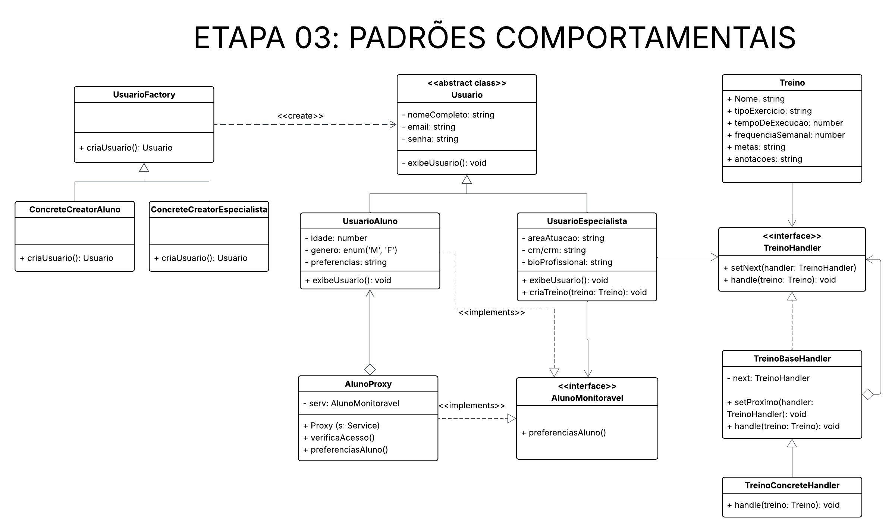
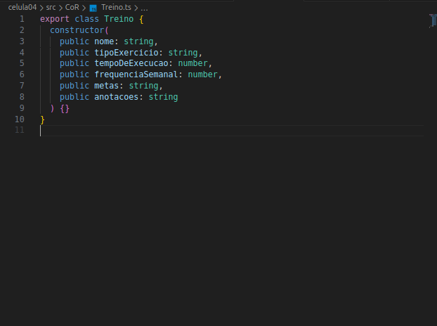
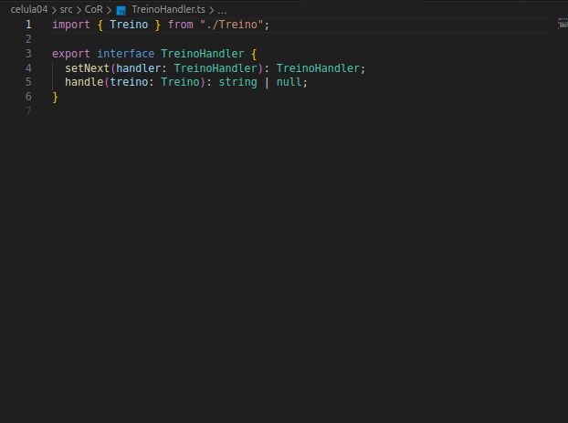
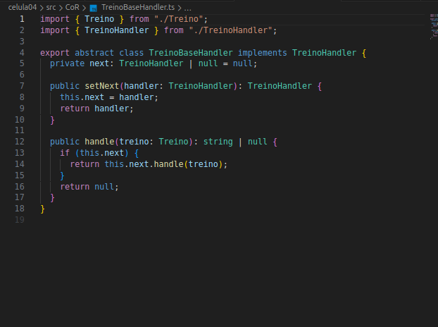
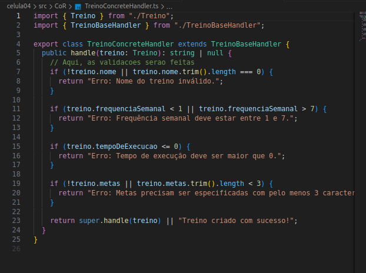
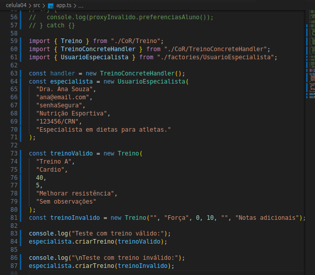
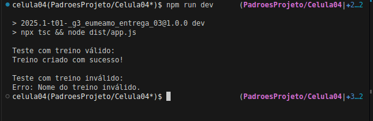

# __Padrão de Projeto: Chain of Responsibility__

## __Introdução__

Este artefato documenta a aplicação do padrão de projeto comportamental Chain of Responsibility no projeto "Eu Me Amo". O padrão Chain of Responsibility tem como propósito evitar o acoplamento entre o remetente de um pedido e seu receptor ao permitir que vários objetos tenham a chance de tratar esse pedido. Os objetos são encadeados e passam o pedido ao longo da cadeia até que um deles o trate.

## __Metodologia__

O padrão Chain of Responsibility foi estudado com base nos materiais recomendados pela professora Milene Serrano, por meio de slides e vídeos disponíveis na plataforma Aprender. Além da utilização do site [Refactoring.guru](https://refactoring.guru/pt-br/design-patterns/factory-method) para uma melhor visualização e visualização de exemplos de implementação.

## __Tabela de Participação na Produção do Artefato__

| 
Nome do Integrante | 
Artefato | 
Descrição da Contribuição | 
Análise Crítica* | 
Link Comprobatório |
|------------|----------|------------|------------|---------|
|  [Luiza Maluf]()| Chain of Responsibility  | Eu modelei, desenvolvi e documentei a aplicação do padrão Chain of Responsibility . | - | [PR #1: Padrões de Projeto: Célula 04](https://github.com/UnBArqDsw2025-1-Turma01/2025.1-T01-_G3_EuMeAmo_Entrega_03/pull/1) |
|  [Lucas Bottino]() | Chain of Responsibility  | Modelei e desenvolvi o padrão Chain of Responsibility | - | [PR #1: Padrões de Projeto: Célula 04](https://github.com/UnBArqDsw2025-1-Turma01/2025.1-T01-_G3_EuMeAmo_Entrega_03/pull/1) |

## __Aplicação no projeto__

No EuMeAmo, usamos CoR para tratar a criação de um treino com base nas preferências, tempo disponível, restrições físicas, entre outros. A classe UsuarioEspecialista age como cliente, disparando a criação do treino através da cadeia.

### __Modelagem__

_**Autores:** [Lucas Bottino]() e [Luiza Maluf]()._

### __Implementação__

- Treino.ts: define a entidade Treino com dados como nome, tempo disponível, preferências etc.
- TreinoHandler.ts: interface que define os métodos setNext e handle.
- TreinoBaseHandler.ts: implementação padrão que armazena o próximo handler e delega a chamada.
- TreinoConcreteHandler.ts: realiza a lógica principal de criação de treino com base nos dados do Treino.

_**src/CoR/Treino.ts**_

_**src/CoR/TreinoHandler.ts**_

_**src/CoR/TreinoBaseHandler.ts**_

_**src/CoR/TreinoConcreteHandler.ts**_

### __Teste de Funcionamento__

## __Rastreabilidade__

- [Diagrama de Classe da entrega 2](https://unbarqdsw2025-1-turma01.github.io/2025.1-T01-_G3_EuMeAmo_Entrega_02/#/Modelagem/2.1.1.DiagramaDeClasses)

## __Referências Bibliográficas__

> REFACTORING.GURU. Padrão de Projeto Chain of Responsability. Refactoring.Guru, 2024. Disponível em: https://refactoring.guru/design-patterns/chain-of-responsibility. Acesso em: 29 maio 2025

## __Histórico de versões__

| Versão | Data | Descrição | Autor | Revisor |
|--------|------|-----------|-------|---------|
| '1.0'  | 29/05/2025 | Criação inicial do artefato de Chain of Responsability| [Luiza Maluf]() | [Lucas Bottino]()| 