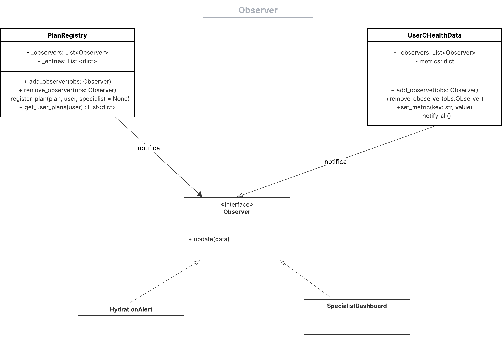
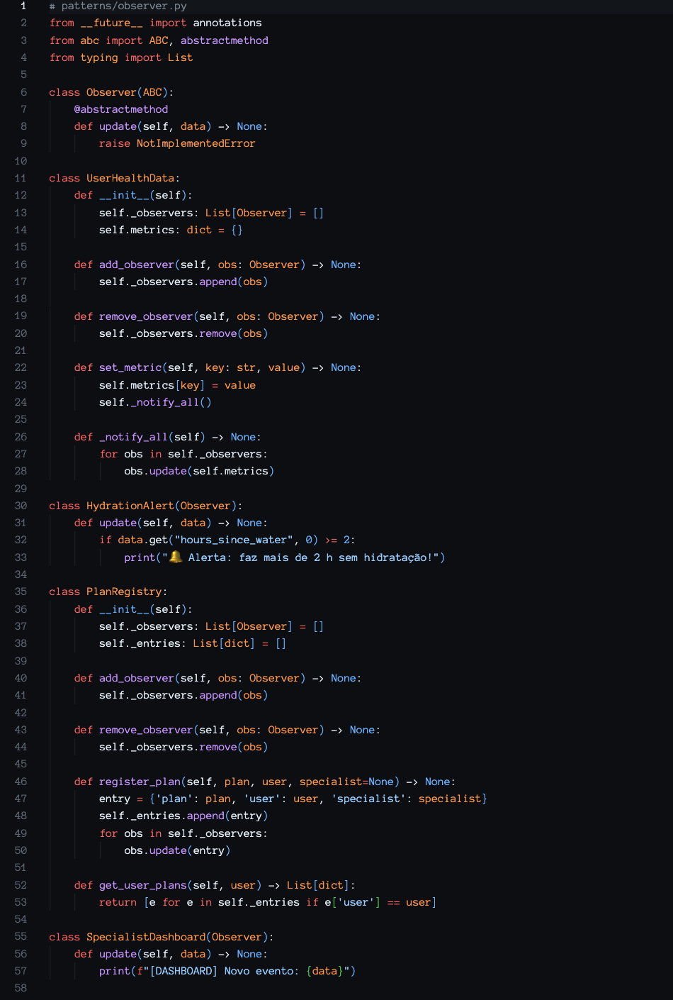

# __Padrão de Projeto: Observer__

## __Introdução__

Este artefato documenta a aplicação do padrão de projeto comportamental Observer no projeto "Eu Me Amo". O padrão Observer tem como objetivo definir uma dependência um-para-muitos entre objetos, de modo que quando um objeto (o sujeito) muda seu estado, todos os seus dependentes (os observadores) são notificados e atualizados automaticamente. Essa abordagem facilita a comunicação entre componentes desacoplados e promove maior flexibilidade no design do sistema.

## __Metodologia__

O padrão **Observer** foi estudado com base nos materiais recomendados pela professora Milene Serrano, incluindo slides e vídeos disponíveis na plataforma Aprender. Também foi consultado o site [Refactoring.guru](https://refactoring.guru/pt-br/design-patterns/observer) para obter uma compreensão mais visual e exemplos práticos de implementação.

## __Tabela de Participação na Produção do Artefato__

| 
Nome do Integrante | 
Artefato | 
Descrição da Contribuição | 
Análise Crítica* | 
Link Comprobatório |
|------------|----------|------------|------------|---------|
| [Mateus Levy](https://github.com/mateus9levy)| Observer  | Modelei, desenvolvi e documentei a aplicação do padrão Observer . | - | [PR #1: Padrões de Projeto: Célula 03](https://github.com/UnBArqDsw2025-1-Turma01/2025.1-T01-_G3_EuMeAmo_Entrega_03/pull/1) |
|   [Gabriel Saraiva](https://github.com/gabrielsarcan) | Observer | Modelei e desenvolvi o padrão Chain of Responsibility | - | [PR #1: Padrões de Projeto: Célula 03](https://github.com/UnBArqDsw2025-1-Turma01/2025.1-T01-_G3_EuMeAmo_Entrega_03/pull/1) |

## __Aplicação no projeto__

No “Eu Me Amo”, o padrão Observer é utilizado para gerenciar a atualização de dados de saúde dos usuários em tempo real. A classe UserHealthData funciona como o sujeito (observable), mantendo uma lista de observadores que são notificados sempre que há mudanças nos dados de saúde. As classes observadoras implementam a interface Observer e atualizam suas informações conforme recebem as notificações, garantindo que diversas partes do sistema fiquem sincronizadas sem depender de acoplamento rígido.

### __Modelagem__

_**Autores:** [Mateus Levy](https://github.com/mateus9levy) e [Gabriel Saraiva](https://github.com/gabrielsarcan)._

### __Implementação__

* **UserHealthData (sujeito/observable):** mantém o estado dos dados de saúde e gerencia uma lista de observadores registrados.
* **Observer (interface):** define o método `update()` que deve ser implementado pelas classes observadoras.
* **Observadores concretos:** classes que implementam a interface `Observer` e recebem notificações para atualizar seus dados ou executar ações em resposta às mudanças no estado de `UserHealthData`.
* **Mecanismo de notificação:** `UserHealthData` notifica automaticamente todos os observadores sempre que seu estado é alterado, garantindo sincronização entre os componentes interessados.

_**project/patterns/prototype.py**_

## __Rastreabilidade__

- [Diagrama de Classe da entrega 2](https://unbarqdsw2025-1-turma01.github.io/2025.1-T01-_G3_EuMeAmo_Entrega_02/#/Modelagem/2.1.1.DiagramaDeClasses)

## __Referências Bibliográficas__

> REFACTORING.GURU. Padrão de Projeto Observer. Refactoring.Guru, 2024. Disponível em: https://refactoring.guru/design-patterns/observer. Acesso em: 28 maio 2025

## __Histórico de versões__

| Versão | Data | Descrição | Autor | Revisor |
|--------|------|-----------|-------|---------|
| '1.0'  | 29/05/2025 | Criação inicial do artefato de Observer| [Mateus Levy](https://github.com/mateus9levy) | [Gabriel Saraiva](https://github.com/gabrielsarcan)| 