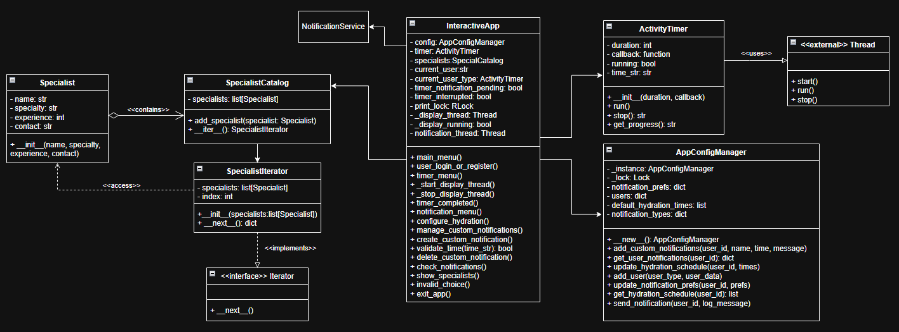

# __Nome do Artefato__

## __Introdução__

O presente artefato documenta a aplicação do padrão de projeto **Iterator**, utilizado no módulo responsável por percorrer e exibir uma coleção de especialistas dentro do sistema “Eu Me Amo — Bem-Estar Integrado”. O objetivo deste artefato é apresentar a estrutura implementada, sua finalidade dentro do projeto, e os ganhos obtidos com o uso desse padrão comportamental.
O Iterator foi aplicado com foco na modularização, encapsulamento e reutilização do código, promovendo uma forma segura e desacoplada de percorrer os objetos da coleção `SpecialistCatalog`.

## __Metodologia__

O padrão de projeto **Iterator** é um padrão **comportamental** descrito no catálogo _Design Patterns: Elements of Reusable Object-Oriented Software_ de Gamma et al. (1994), cuja principal finalidade é permitir o acesso sequencial aos elementos de uma coleção **sem expor sua estrutura interna**.

## __Tabela de Participação na Produção do Artefato__

<center>

| <center>Nome do<br>Integrante | <center>Artefato | <center>Descrição da<br>Contribuição | <center>Análise Crítica | <center>Link Comprobatório |
|------------|----------|------------|------------|---------|
|  [Arthur Fonseca](https://github.com/arthurfonsecaa)| Interator |  |  | [PR #7: Padrões de Projeto: Célula 02](https://github.com/UnBArqDsw2025-1-Turma01/2025.1-T01-_G3_EuMeAmo_Entrega_03/pull/7)|
|  [Fillipe Souto](https://github.com/fillipeb50)| Interator | Eu modelei, desenvolvi e documentei a aplicação do padrão Interator | O padrão Iterator permite percorrer os elementos de uma coleção de forma ordenada, sem depender de sua estrutura interna, contribuindo para um código mais desacoplado. Porém, quando utilizado em excesso, pode tornar o sistema mais complexo e afetar o desempenho, especialmente em coleções muito extensas. | [PR #7: Padrões de Projeto: Célula 02](https://github.com/UnBArqDsw2025-1-Turma01/2025.1-T01-_G3_EuMeAmo_Entrega_03/pull/7)|
|  [Letícia Hladczuk](https://github.com/HladczukLe)| Interator | Eu contribui na modelagem e desenvolvimento do padrão Iterator. | O padrão Iterator facilita o acesso sequencial a elementos de uma coleção, promovendo baixo acoplamento. No entanto, seu uso excessivo pode aumentar a complexidade do código e impactar a performance, principalmente em coleções grandes.| [PR #7: Padrões de Projeto: Célula 02](https://github.com/UnBArqDsw2025-1-Turma01/2025.1-T01-_G3_EuMeAmo_Entrega_03/pull/7)|

</center>

## __Aplicação no projeto__

O padrão de projeto **Iterator** foi aplicado no módulo de especialistas com o propósito de permitir a **navegação sequencial e segura** sobre uma coleção de objetos `Specialist`, sem expor diretamente a estrutura interna da lista. Essa abordagem oferece uma separação clara entre a lógica de armazenamento dos dados e a forma como eles são acessados, favorecendo a coesão e o baixo acoplamento entre os componentes do sistema.

A estrutura foi composta por três classes principais:

- **`Specialist`**, que representa o modelo individual de um especialista, contendo dados como nome, especialidade, anos de experiência e contato;
- **`SpecialistCatalog`**, que encapsula a lista de especialistas e oferece o método `__iter__()` para fornecer um iterador específico;
- **`SpecialistIterator`**, que implementa a lógica de iteração, permitindo o retorno de um especialista por vez no formato de dicionário, com os dados já formatados para exibição.

Essa implementação foi crucial para a exibição dinâmica dos especialistas dentro da aplicação “Eu Me Amo — Bem-Estar Integrado”, especialmente no módulo de interação com o usuário, onde o catálogo é percorrido para apresentar informações detalhadas de cada profissional.

Ao aplicar o Iterator, obtivemos **independência entre o código que consome os especialistas e a estrutura da coleção em si**, abrindo margem para futuras modificações — como substituição da lista por uma fonte de dados externa (banco de dados, API, etc.) — sem que isso impacte o restante da aplicação.

Além disso, a adoção do Iterator reforça os princípios de projeto orientado a objetos, como o **Princípio da Responsabilidade Única** e o **Princípio de Aberto/Fechado** (OCP, do SOLID), promovendo escalabilidade e manutenibilidade do código.

A aplicação deste padrão comportamental se mostrou adequada ao contexto, contribuindo para uma arquitetura mais organizada, reutilizável e fácil de testar, respeitando os limites de responsabilidade de cada componente.

### __Modelagem__

<center>



_**Autores:** [Arthur Fonseca](), [Fillipe Souto]() e [Leticia Hladczuk]()._
</center>

### __Implementação__

###  Código-Fonte

```python
import random

def gerar_contato():
    prefixo = "+55 61 9"
    sufixo = "".join(str(random.randint(0, 9)) for _ in range(4))
    # Formato: +55 61 9XXXX-XXXX
    return f"{prefixo}{sufixo[:4]}-{sufixo}"

class Specialist:
    def __init__(self, name: str, specialty: str, experience: int, contact: str):
        self.name = name
        self.specialty = specialty
        self.experience = experience
        self.contact = contact

class SpecialistCatalog:
    def __init__(self):
        self.specialists = []
    
    def add_specialist(self, specialist: Specialist):
        self.specialists.append(specialist)
    
    def __iter__(self):
        return SpecialistIterator(self.specialists)

class SpecialistIterator:
    def __init__(self, specialists: list[Specialist]):
        self.specialists = specialists
        self.index = 0
    
    def __next__(self):
        if self.index < len(self.specialists):
            sp = self.specialists[self.index]
            self.index += 1
            return {
                'name': sp.name,
                'specialty': sp.specialty,
                'experience': f"{sp.experience} anos",
                'contact': sp.contact
            }
        raise StopIteration()

if __name__ == "__main__":
    catalog = SpecialistCatalog()
    catalog.add_specialist(Specialist("Dra. Ana", "Fisioterapia", 8, gerar_contato()))
    catalog.add_specialist(Specialist("Dr. Carlos", "Nutrição", 5, gerar_contato()))

    print("Especialistas disponíveis:")
    for idx, specialist in enumerate(catalog, 1):
        print(f"{idx}. {specialist['name']} - {specialist['specialty']} "
              f"- Exp: {specialist['experience']} - Contato: {specialist['contact']}")

```

###  Exemplo de uso

```python
catalog = SpecialistCatalog()
catalog.add_specialist(Specialist("Dra. Ana Lima", "Psicologia", 10, "+55 61 91234-5678"))

for spec in catalog:
    print(f"{spec['name']} - {spec['specialty']}")
```
### __Funcionamento do Projeto__

<iframe width="560" height="315" src="https://www.youtube.com/embed/zfsI5L--x5c?si=MzqqcT8fHyHleIi1&amp;start=148" title="YouTube video player" frameborder="0" allow="accelerometer; autoplay; clipboard-write; encrypted-media; gyroscope; picture-in-picture; web-share" referrerpolicy="strict-origin-when-cross-origin" allowfullscreen></iframe>

## __Gravação da Produção do Artefato__

<center>

<iframe width="560" height="315" src="https://www.youtube.com/embed/hBBzDHLvbuk?si=dSW_9b035BPHkdQc" title="YouTube video player" frameborder="0" allow="accelerometer; autoplay; clipboard-write; encrypted-media; gyroscope; picture-in-picture; web-share" referrerpolicy="strict-origin-when-cross-origin" allowfullscreen></iframe>

</center>

## __Rastreabilidade__

- [Diagrama de Classe da entrega 2](https://unbarqdsw2025-1-turma01.github.io/2025.1-T01-_G3_EuMeAmo_Entrega_02/#/Modelagem/2.1.1.DiagramaDeClasses)


## __Referências Bibliográficas__

- REFATORING.GURU. *Padrão Interator*. Disponível em: [https://refactoring.guru/pt-br/design-patterns/iterator](https://refactoring.guru/pt-br/design-patterns/iterator). Acesso em: 29 maio 2025.

- TUTORIALSPOINT. *Python Design Patterns - Interator*. Disponível em: [https://www.tutorialspoint.com/design_pattern/iterator_pattern.htm](https://www.tutorialspoint.com/design_pattern/iterator_pattern.htm). Acesso em: 29 maio. 2025.


## __Histórico de versões__

| Versão | Data | Descrição | Autor | Revisor |
|--------|------|-----------|-------|---------|
| '1.0'  | 01/06/2025 | Documentação do Interator | [Fillipe Souto](https://github.com/fillipeb50) | [Revisor]()| 