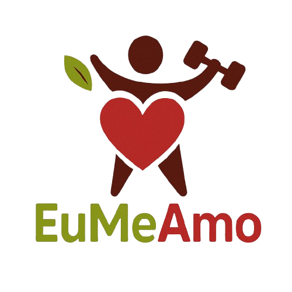

# __Projeto EuMeAmo__

### __Arquitetura e Desenho de Software__

#### __Entrega 3__

---

## Sobre 

**Projeto G3 - *Eu Me Amo*** é uma iniciativa voltada ao bem-estar físico e emocional, inspirada em plataformas e materiais informativos sobre autocuidado. O objetivo do projeto é promover hábitos saudáveis por meio de conteúdos que incentivam uma boa postura, a prática regular de exercícios físicos, o equilíbrio mental e o amor-próprio.

A solução desenvolvida pode ser apresentada em diferentes formatos — como site, aplicativo desktop ou app mobile — sempre buscando oferecer uma experiência acessível, intuitiva e acolhedora para quem deseja cuidar melhor de si.

---
## __Participantes__

  

    
    
<strong>Arthur Fonseca Vale</strong> <small>221031120</small>

  

  

    
    
<strong>Carlos Henrique de Souza Bispo</strong> <small>211061529</small>

  

  

    
    
<strong>Fillipe Souto de Andrade</strong> <small>190087188</small>

  

  

    
    
<strong>Gabriel Saraiva Canabrava</strong> <small>202045769</small>

  

  

    
    
<strong>Letícia de Cássia Hladczuk Rodrigues</strong> <small>221039209</small>

  

  

    
    
<strong>Lucas Gama De Araujo Bottino</strong> <small>221008267</small>

  

  

    
    
<strong>Luiza Maluf Amorim</strong> <small>221008294</small>

  

  

    
    
<strong>Mateus Levy Avelans Boquady</strong> <small>190113901</small>

  

  

    
    
<strong>Pablo Serra Carvalho</strong> <small>221008679</small>

  

  

    
    
<strong>Rodrigo Fonseca Rodrigues</strong> <small>211062722</small>

  

---

## __Screenshots dos Artefatos da Segunda Entrega__

## Há algo a ser executado?

( ) SIM

(X) NÃO

## Histórico de Versões

| Versão | Data | Descrição | Autor(es) | Revisor(es) | 
| :----: | :--: | --------- | ----------- | ------ |
| '1.0'  | 28/04/2025 | Criação do documento |[Luiza](Luiza) |  | 
